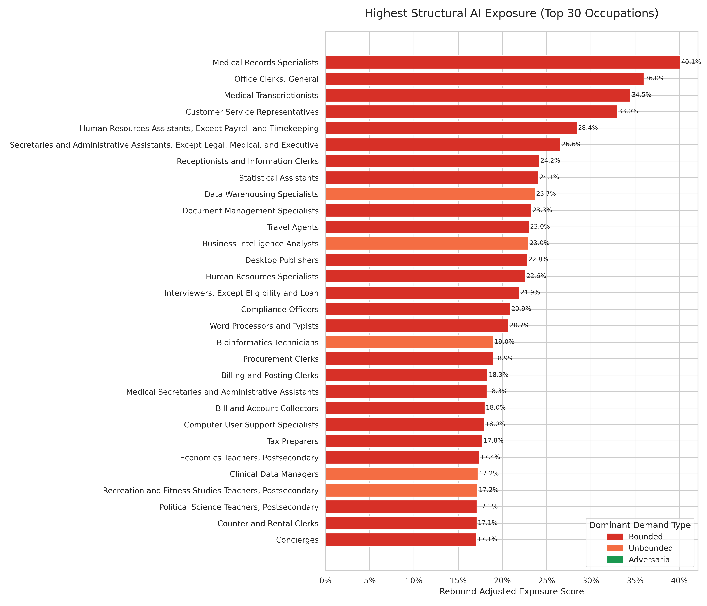

# AI Labor Exposure

> A data pipeline designed to move beyond static estimates of "AI observed exposure"—the assumption that if a model can do a task, human labor will proportionally decrease. Instead, this project categorizes O*NET tasks according to their fundamental economic demand rules: **Bounded, Unbounded, and Adversarial**.
>
> By applying dynamic demand classifications against Anthropic's Economic Index and occupational data using LLM-assisted pipelines, this repository seeks to measure not just *where* AI acts as a replacement, but where it acts as a productivity engine (The Infinite Frontier) or fuels zero-sum escalation (The Arms Race).

## Influences & Background

* **[AI Jobs: The Hidden Rules of Demand](https://substack.norabble.com/p/ai-jobs-the-hidden-rules-of-demand)** (`norabble`) - *The core theoretical framework for Bounded, Unbounded, and Adversarial demand dynamics.*
* **[Anthropic's Labor Market Impacts](https://www.anthropic.com/research/labor-market-impacts)** - *The foundational "Observed Exposure" dataset mapping AI capabilities to O\*NET task statements.*

## Demand Type Framework

| Type | Mechanism | Example Roles |
|------|-----------|---------------|
| **Bounded** | Finishing faster reduces workers needed; no new demand is created | Payroll, Data Entry |
| **Unbounded** | Efficiency unlocks a backlog of unmet demand; output expands | Programming, Science, Healthcare |
| **Adversarial** | Zero-sum competition; time saved is reinvested to stay ahead | Law, Sales, Marketing, Cybersecurity |

## Key Findings

The pipeline produces two model outputs and tests both against BLS employment and
wage data (2022–2025). What the demand-type lens buys you:

**Sectors with the most Unbounded "absorption capacity" are measurably gaining
employment.** The dynamic equilibrium model's signed `net_employment_change`
score correlates with actual BLS sector employment growth at **r = +0.528
(p = 0.012)** economy-wide, strengthening to **r ≈ +0.54 (p < 0.01)** in both
2023→24 and 2024→25. This is the strongest signal in the project — and it only
emerges once tasks are stratified by demand type. Raw "AI can do this task"
coverage shows no comparable sector signal (r = +0.19, n.s.).


**Demand type sharpens the displacement signal on employment — and it's
growing.** Among occupations with measured AI penetration, the rebound-adjusted
exposure score predicts 2024→25 employment decline better than raw coverage
(r = −0.219 vs. −0.175), and that correlation has strengthened every year since
2022. The hardest-hit high-exposure occupations include Computer Programmers
(−16%), Technical Writers (−18%), and Statistical Assistants (−20%).



**Occupation-level effects are real but small; the economy-wide redistribution is
where the structure shows up.** Individual-occupation correlations are weak
(|r| < 0.22) — expected, since AI's labor effects are only beginning to surface
in annual data. Aggregating to sectors, where the redistribution constraint
binds, is where the model earns its keep.

**Wages show no AI signal.** Apparent negative wage correlations in 2022→23 are a
post-COVID recovery artifact (physical and care sectors catching up after
pandemic labor shortages), not AI — the signal disappears once those sectors are
excluded.

### Going deeper

- **[docs/framework.md](docs/framework.md)** — the full conceptual framework:
  exposure-type taxonomy, demand-type definitions, and the dynamic equilibrium
  model derivation.
- **[docs/model_vs_observed_exposure.md](docs/model_vs_observed_exposure.md)** —
  head-to-head: does demand-type classification beat raw AI coverage at
  predicting BLS outcomes? Results keyed by outcome × aggregation level.
- **[docs/charts/](docs/charts/)** — per-figure writeups for all 30+ validation
  charts, each with correlations, caveats, and interpretation.

## Prerequisites

- Python 3.12+ with [uv](https://docs.astral.sh/uv/)
- Node.js (for BLS data download — BLS blocks plain HTTP requests, requiring a headless browser)
- A GCP project with Vertex AI enabled (for the classification stage only)

## Setup

```bash
# Install Python and Node dependencies, set up pre-commit hooks
make setup
```

Create a `.env` file in the project root:

```
GCP_PROJECT_ID=your-gcp-project-id
GCP_LOCATION=us-central1
```

## Running the Pipeline

The pipeline has two phases. Phase 1 (classification) is expensive and slow; it only needs to run once.

### Phase 1 — Classify O\*NET Tasks (one-time, ~19k LLM calls)

```bash
make download-data   # Download O*NET, Anthropic, and BLS source data
make classify        # Classify all tasks via Vertex AI (resumable if interrupted)
```

Output: `data/output/classified_all_tasks.csv`

### Phase 2 — Synthesize and Validate

```bash
make run-pipeline
# or selectively:
uv run main.py synthesize plot
uv run main.py validate
```

Stages:

| Stage | Input | Output |
|-------|-------|--------|
| `analyze` | `data/raw/bls/*.zip` | `data/output/bls_trends.csv` |
| `synthesize` | classified tasks + penetration data | `data/output/occupation_exposure_report.csv` |
| `plot` | occupation exposure report | `data/output/visualizations/*.png` |
| `validate` | exposure report + BLS trends | correlation statistics + validation plots |

## Models

### Rebound-adjusted exposure (static)

The occupation-level exposure score is a task-importance-weighted average of per-task exposures:

```
task_exposure = penetration × (1 − rebound_fraction) × task_importance

Bounded:     rebound = 0.1  →  90% of penetration is structural exposure
Unbounded:   rebound = 0.7  →  30% structural; demand expansion absorbs the rest
Adversarial: rebound = 0.9  →  10% structural; arms-race escalation absorbs the rest
```

Scores are non-negative; higher values indicate greater structural exposure pressure. The rebound fractions in `synthesize_impacts.py` are intentionally exposed as tunable research parameters.

### Dynamic labor equilibrium (macro)

A second model holds total employment constant and redistributes Bounded + Adversarial displacement economy-wide into Unbounded-capacity occupations:

```
gross_displacement  = bounded_exposure_contribution + adversarial_exposure_contribution
absorption          = (pct_unbounded / economy_avg_pct_unbounded) × total_displaced
net_employment_change = absorption − gross_displacement
```

The signed `net_employment_change` sums to zero by construction. Validated against BLS at the sector level: r = +0.528 (p = 0.012) for composite employment growth, strengthening to r ≈ +0.54 (p < 0.01) in 2023→24 and 2024→25.

## Outputs

| File | Description |
|------|-------------|
| `occupation_exposure_report.csv` | Per-occupation rebound-adjusted exposure score, demand type breakdown, penetration metrics, and exposure tier |
| `occupation_dynamic_model_report.csv` | Dynamic equilibrium model — signed `net_employment_change` per occupation; employment-weighted sum = 0 |
| `bls_trends.csv` | BLS employment and wage growth by occupation (2022–2025) |
| `exposure_volume_by_occupation.csv` | Employment-weighted AI exposure by occupation |
| `exposure_volume_by_group.csv` | Same metric rolled up to SOC major group |
| `employment_by_demand_type.csv` | Workers in each demand type bucket with mean exposure scores |

Visualizations (30+ charts) are saved to `data/output/visualizations/`. See [CLAUDE.md](CLAUDE.md#outputs-reference) for the full list with descriptions.

## Development

```bash
make test    # Run unit tests
make lint    # Ruff check + format
```
