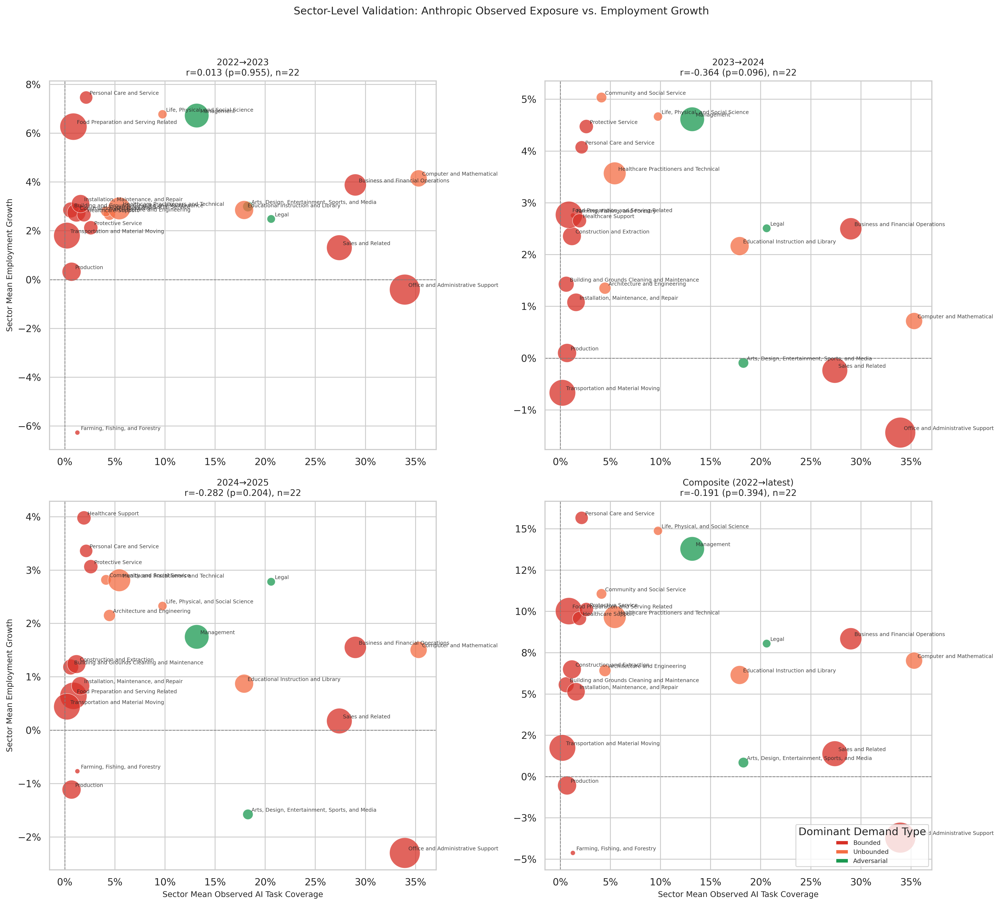

# Anthropic Observed Exposure: Sector-Level Employment Validation

**File:** `anthropic_observed_sector_level_employment_validation.png`

## What this chart shows

Each bubble is one BLS major occupational group. The x-axis is the sector's employment-weighted mean `observed_exposure` from Anthropic's Economic Index — the fraction of the sector's O\*NET tasks that appear in actual Claude conversation logs. The y-axis is the sector's mean BLS employment growth for the given period.

This measures not what AI *could* do (Eloundou) or what the demand-type model predicts (rebound/dynamic), but what AI is *currently being used for* at the sector level.

## Correlation by period

| Period | r | p |
|--------|---|---|
| 2022→2023 | +0.023 | 0.933 |
| 2023→2024 | +0.364 | 0.096 |
| 2024→2025 | +0.282 | 0.204 |
| Composite | +0.191 | 0.394 |

## Key observations

**Weak positive trend emerging in 2023→24 (r = +0.364, p = 0.096).** Sectors with higher observed AI task coverage grew faster in 2023→24, approaching significance. This is in the same direction as the dynamic model but weaker. The pattern persists but attenuates in 2024→25.

**The x-axis range is narrower than Eloundou's.** Observed coverage is capped by what tasks have actually appeared in Claude conversations — most sectors cluster between 5% and 30%, compared to Eloundou's 30–65% range. This compression limits the statistical leverage of the x-axis.

**The near-zero 2022→23 reading is informative.** Even though 2022→23 shows essentially no correlation (r = +0.023), this doesn't mean nothing was happening — it likely means AI task adoption was not yet concentrated enough at the sector level to differentiate employment outcomes. The positive trend in 2023→24 suggests the signal is strengthening over time.

**Office and Administrative Support is the dominant outlier.** The large Bounded red bubble (highest observed coverage, ~30–35%) sits in the middle of the y-axis range — it grew modestly despite heavy AI task usage. This is the same outlier pattern seen in the rebound and dynamic model sector charts.

## Comparison to other employment models

| Model | Emp composite r | Emp 2023→24 r |
|-------|----------------|---------------|
| Anthropic observed | +0.191 | +0.364 † |
| Eloundou theoretical | +0.122 | +0.071 |
| Rebound-adjusted | −0.247 | −0.412 |
| Dynamic equilibrium | +0.528 ** | +0.544 ** |

(† p<0.10, ** p<0.01)

The Anthropic observed model sits between the Eloundou (no signal) and dynamic (strong signal) models. Its 2023→24 trend is directionally consistent with the dynamic model but substantially weaker — consistent with the interpretation that observed AI coverage is correlated with Unbounded sector composition, but the dynamic model's explicit redistribution calculation sharpens that signal.
