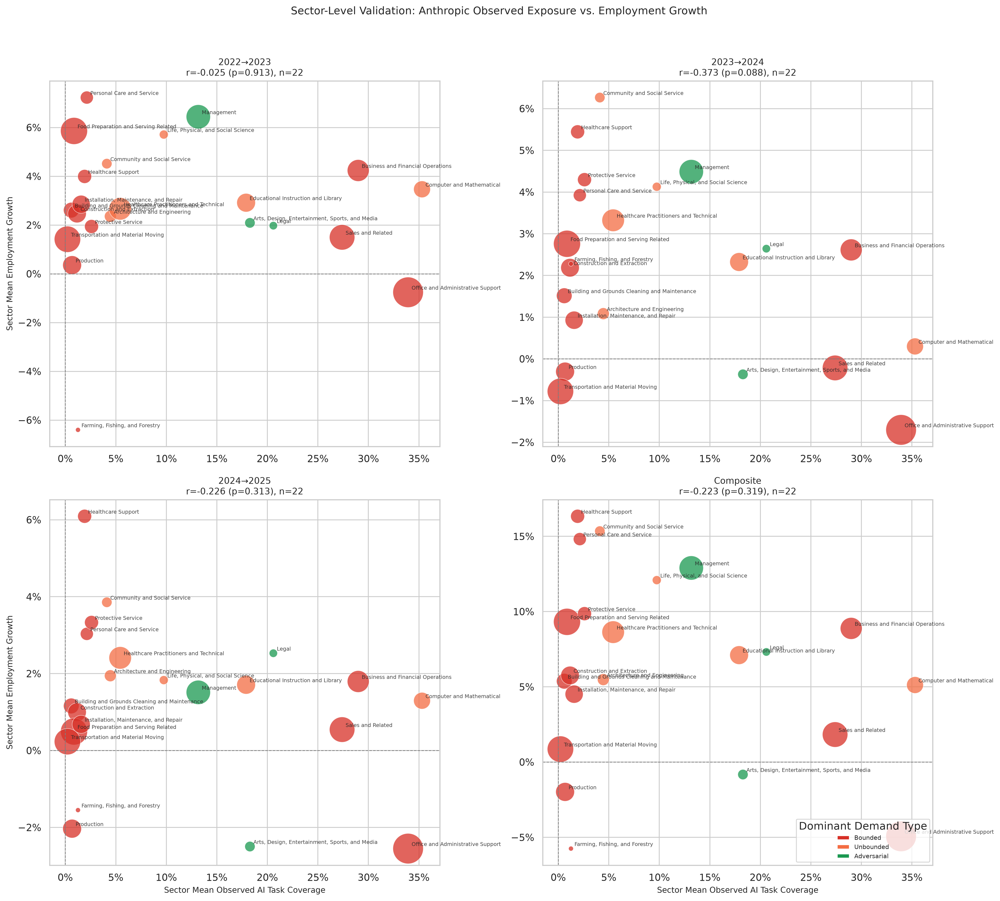

# Anthropic Observed Exposure: Sector-Level Employment Validation

**File:** `anthropic_observed_sector_level_employment_validation.png`

## What this chart shows

Each bubble is one BLS major occupational group. The x-axis is the sector's employment-weighted mean `observed_exposure` from Anthropic's Economic Index — the fraction of the sector's O\*NET tasks that appear in actual Claude conversation logs. The y-axis is the sector's total-employment growth for the given period, from the OEWS major-group summary row (`bls_sector_trends.csv`).

This measures not what AI *could* do (Eloundou) or what the demand-type model predicts (rebound/dynamic), but what AI is *currently being used for* at the sector level.

## Correlation by period

| Period | r | p |
|--------|---|---|
| 2022→2023 | −0.025 | 0.913 |
| 2023→2024 | −0.373 | 0.088 |
| 2024→2025 | −0.226 | 0.313 |
| Composite | −0.223 | 0.319 |

Observed coverage is a *gross* exposure measure, so a **negative** r is the
hypothesised direction: sectors where AI already covers more tasks should show
weaker employment growth.

## Key observations

**Weak negative trend emerging in 2023→24 (r = −0.373, p = 0.088).** Sectors with higher observed AI task coverage grew *slower* in 2023→24, approaching but not reaching significance. That is the hypothesised direction for a gross coverage measure. The pattern persists but attenuates in 2024→25 (r = −0.226).

**The x-axis range is narrower than Eloundou's.** Observed coverage is capped by what tasks have actually appeared in Claude conversations — most sectors cluster between 5% and 30%, compared to Eloundou's 30–65% range. This compression limits the statistical leverage of the x-axis.

**The near-zero 2022→23 reading is informative.** Even though 2022→23 shows essentially no correlation (r = −0.025), this doesn't mean nothing was happening — it likely means AI task adoption was not yet concentrated enough at the sector level to differentiate employment outcomes. The negative trend appearing in 2023→24 is consistent with a signal that emerges after 2022 rather than one that was already present.

**Office and Administrative Support is the most influential point.** The large Bounded red bubble (highest observed coverage, ~34%) is one of three sectors whose total employment fell over 2022→25. It anchors the negative slope here as it anchors the rebound and dynamic model sector charts.

## Comparison to other employment models

| Model | Emp composite r | Emp 2023→24 r | Correct sign |
|-------|----------------|---------------|--------------|
| Anthropic observed | −0.223 | −0.373 † | negative |
| Eloundou theoretical | +0.018 | −0.140 | negative |
| Rebound-adjusted | −0.290 | −0.428 * | negative |
| Dynamic equilibrium | +0.509 * | +0.530 * | positive |

(† p<0.10, * p<0.05)

**Read the sign column before comparing rows.** The first three are gross
exposure measures, where the hypothesis predicts a negative r. `net_employment_change`
is signed the other way — it is already a predicted *gain* — so for the dynamic
model a positive r is the correct direction. All four rows above therefore point
the same way in meaning; only their raw signs differ.

On that reading, the Anthropic observed model sits between Eloundou (no signal)
and the dynamic model (strong signal). Its 2023→24 result is in the hypothesised
direction and comparable in magnitude to the rebound-adjusted model, which just
reaches p < 0.05 that year while observed coverage does not; the dynamic model
does at both horizons.
