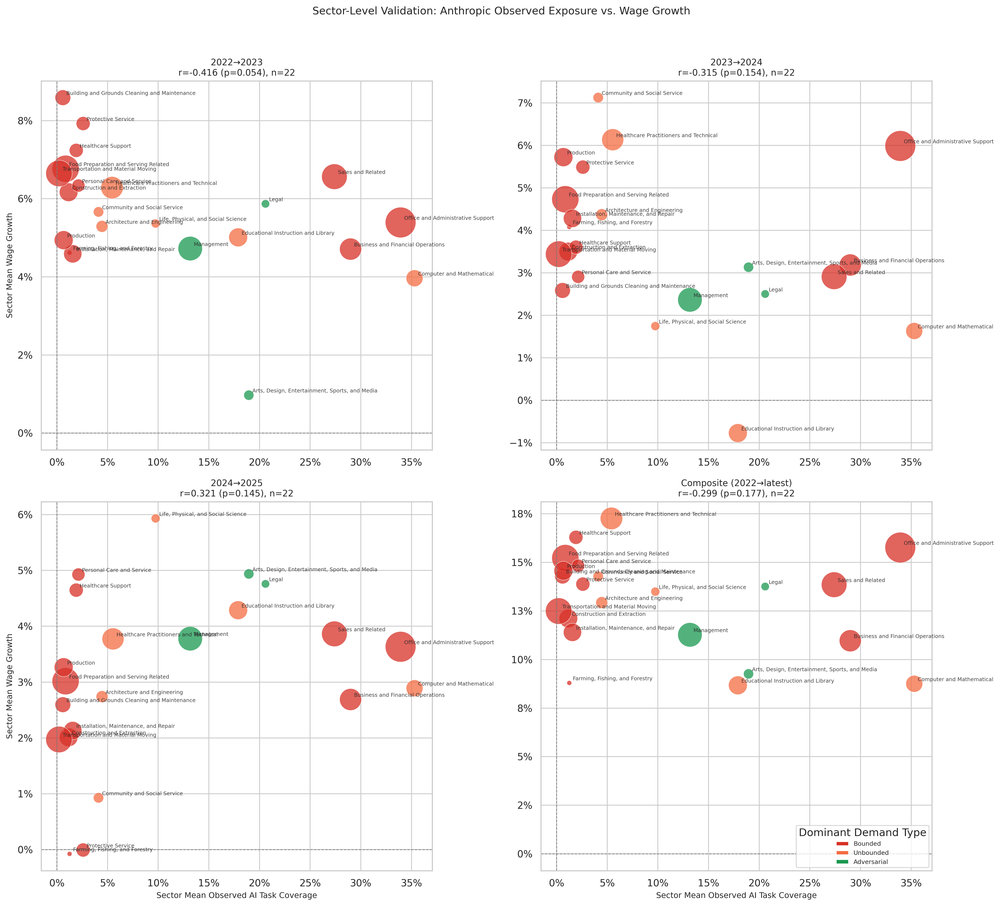

# Anthropic Observed Exposure: Sector-Level Wage Validation

**File:** `anthropic_observed_sector_level_wage_validation.png`

## What this chart shows

Same layout as `anthropic_observed_sector_level_employment_validation.png` but with sector mean wage growth on the y-axis. Four panels: 2022→23, 2023→24, 2024→25, composite.

## Correlation by period

| Period | r | p |
|--------|---|---|
| 2022→2023 | −0.416 | 0.054 |
| 2023→2024 | −0.315 | 0.154 |
| 2024→2025 | +0.321 | 0.145 |
| Composite | +0.299 | 0.177 |

## Key observation: borderline negative wage signal in 2022→23

**r = −0.416, p = 0.054** in 2022→23 is borderline significant. Sectors with higher observed AI task coverage had lower wage growth in that year. This is directionally identical to the Eloundou finding (r = −0.504, p = 0.017) and jointly strengthens the case that the 2022→23 negative wage correlation is real rather than noise — it appears in both capability-based and usage-based exposure measures independently.

## The sign flip pattern matches Eloundou exactly

| Period | Eloundou wage r | Anthropic observed wage r |
|--------|----------------|--------------------------|
| 2022→2023 | −0.504 * | −0.416 † |
| 2023→2024 | +0.228 | −0.315 |
| 2024→2025 | +0.380 | +0.321 |
| Composite | +0.245 | +0.299 |

(* p<0.05, † p<0.10)

Both models show:
- Negative wage correlation in 2022→23 (significant or near-significant)
- A transition period in 2023→24 (divergent in sign but both non-significant)
- Positive trending in 2024→25 (non-significant in both)
- Near-zero or weakly positive composites

The agreement across two independent exposure measures on the 2022→23 sign and the subsequent reversal is the most noteworthy cross-model finding in the sector-level validation suite.

## What the sign flip means

The negative-then-positive pattern in wages is consistent with a two-phase AI labor market response:

**Phase 1 (2022→23):** Sectors where AI is most capable or most used experience wage moderation as employers anticipate or begin to capture AI productivity gains. Labor supply in those sectors has not adjusted yet; wages soften relative to lower-exposure sectors.

**Phase 2 (2023→25):** Productivity gains in AI-exposed sectors begin to translate into higher wages as workers in those sectors become more productive per hour, and tight overall labor markets put a floor under compensation.

This two-phase pattern — compression then expansion — is consistent with historical technology adoption cycles in manufacturing and services, where the initial period of technology adoption correlates with wage moderation before productivity sharing catches up.

## Caveats

With n = 22 sectors, both of these correlations are sensitive to individual influential points. Office and Administrative Support (the large red bubble with high observed coverage) and Arts/Entertainment (the Adversarial outlier with low wage growth) are the two most influential observations. The cross-model agreement reduces but does not eliminate this concern.
