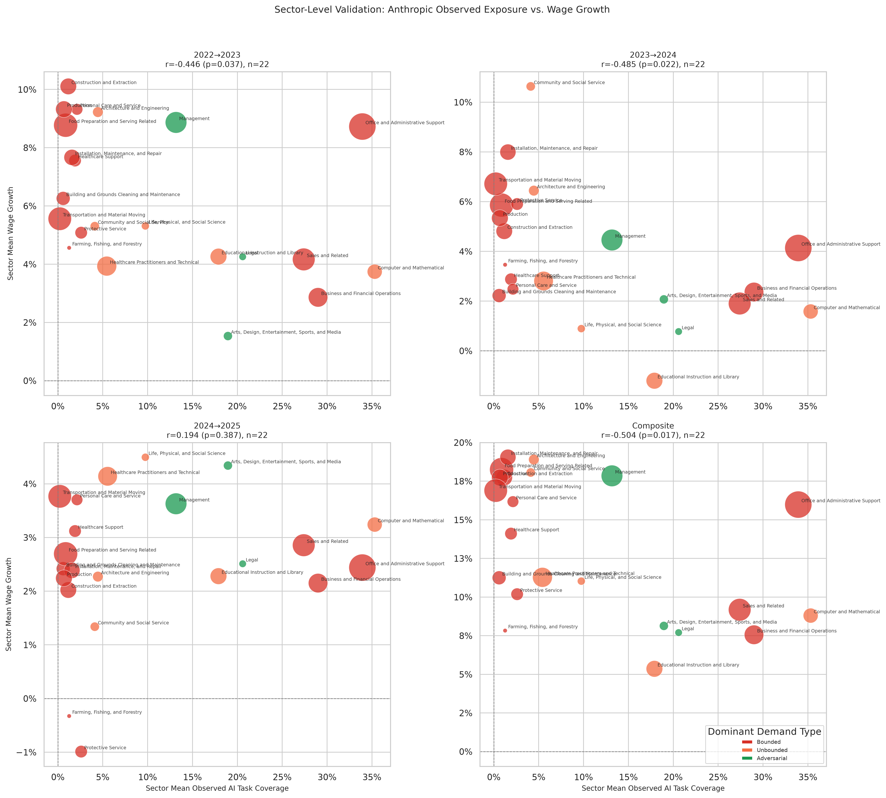

# Anthropic Observed Exposure: Sector-Level Wage Validation

**File:** `anthropic_observed_sector_level_wage_validation.png`

## What this chart shows

Same layout as `anthropic_observed_sector_level_employment_validation.png` but with the growth of each major group's median wage (from `bls_sector_trends.csv`) on the y-axis. Four panels: 2022→23, 2023→24, 2024→25, composite.

## Correlation by period

| Period | r | p |
|--------|---|---|
| 2022→2023 | −0.442 | 0.040 |
| 2023→2024 | −0.484 | 0.022 |
| 2024→2025 | +0.190 | 0.397 |
| Composite | −0.502 | 0.017 |

## Sectors with high observed coverage had the weakest median-wage growth

Measured against each major group's own median wage, this is the one sector-level wage result in the pipeline that is significant and robust: the composite r = −0.502 (p = 0.017) stays between −0.45 and −0.63 (all p ≤ 0.040) when any single sector is dropped, and two of the three annual periods are significant on their own. The direction is the hypothesised one for a gross coverage measure.

The sectors with the highest observed coverage — Computer and Mathematical (35%), Office and Administrative Support (34%), Business and Financial (29%), Sales (27%), Legal (21%), Arts and Media (18%), Education (18%) — all posted composite median-wage growth of 5% to 16% over 2022→25, against 16% to 19% for Construction, Production, Installation and Repair, Food Preparation, Management, and Architecture and Engineering.

## How much of this is the post-COVID recovery

Part. The sectors with the lowest coverage are physical and care occupations that were wage-suppressed during COVID and recovered first, and the 2022→23 period carries that catch-up. But excluding the six most obvious recovery sectors (Construction, Production, Personal Care, Food Preparation, Installation and Repair, Healthcare Support) leaves the 2022→23 correlation at r = −0.322 and the composite at r = −0.421 (p = 0.105) — attenuated, not gone. The remaining relationship is low wage growth in the high-coverage knowledge sectors themselves, which the recovery story does not explain.

## The Eloundou measure does not share this result

| Period | Eloundou wage r | Anthropic observed wage r |
|--------|----------------|--------------------------|
| 2022→2023 | −0.394 | −0.442 * |
| 2023→2024 | −0.333 | −0.484 * |
| 2024→2025 | +0.298 | +0.190 |
| Composite | −0.345 | −0.502 * |

(* p<0.05)

Both measures assign low scores to physical sectors, so both pick up the recovery confound in 2022→23. Only observed coverage — what AI is actually being used for, rather than what it theoretically could do — carries a signal beyond it. See `eloundou_sector_level_wage_validation.md`.

## What this means for the wage validation

Neither demand-type model has a sector-level wage signal (`sector_level_wage_validation.md`, `dynamic_sector_level_wage_validation.md`), so the demand-type discount discards wage information the underlying coverage measure carries. Whether the coverage–wage relationship is AI-driven or a composition effect of knowledge-sector wage cycles cannot be settled at n = 22; the 2024→25 sign flip to weakly positive is worth watching in future releases.
