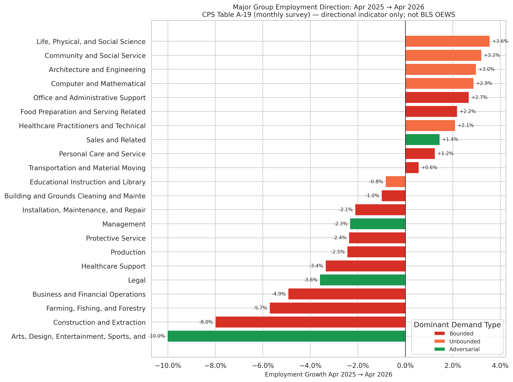

# CPS 2026 Employment Direction by Major Group

**File:** `cps_2026_direction.png`

## Data source

BLS Current Population Survey (CPS), Table A-19: Employed persons by detailed occupation, sex, race, and Hispanic or Latino ethnicity. The chart uses the **Total (16 years and over)** column, comparing April 2025 to April 2026.

This is **not** BLS Occupational Employment and Wage Statistics (OEWS). Key differences:

| Dimension | BLS OEWS (pipeline primary) | CPS Table A-19 (this chart) |
|-----------|-----------------------------|-----------------------------|
| Frequency | Annual (May reference month) | Monthly |
| Sample size | ~1.1M employer records | ~60k household interviews |
| Occupation detail | ~830 SOC 6-digit codes | ~30 major occupation groups |
| Latest available | May 2025 (released May 2026) | April 2026 |
| Wage data | Yes | No |

## What this chart shows

Each bar is one CPS major occupation group, showing the percentage change in estimated employment from April 2025 to April 2026. Bars are colored by the dominant demand type for that SOC major group, as determined by the model's `exposure_volume_by_group.csv`.

This extends the BLS OEWS data (which runs through May 2025) by one additional year, but only at the major-group level and without wage information.

## How to interpret it

**Context: April 2025 to April 2026 is a single one-year snapshot.** CPS monthly figures are subject to sampling error. Changes smaller than ~2% are within the margin of noise for many groups. The chart is best read as a directional signal — which broad groups are expanding vs. contracting — not as a precise measurement.

**Demand type coloring** reflects whether the group's modeled AI impact is primarily driven by Bounded (permanent displacement), Unbounded (productivity absorption), or Adversarial (arms-race) tasks. If the model is correct, Bounded groups should tend toward contraction and Unbounded/Adversarial groups toward expansion over this period.

## Honest limitations

- The CPS captures employed persons, not job postings. A group can grow in employment while productivity-per-worker rises — that's consistent with either displacement (fewer workers doing the same output) or expansion (more output with same workers). The direction alone doesn't distinguish.
- CPS occupational coding is coarser than OEWS. "Computer and Mathematical Occupations" includes both software engineers (likely Unbounded, growing) and statistical assistants (likely Bounded, declining). The group average can mask divergence within it.
- One year of CPS data cannot confirm or refute the model's long-run displacement predictions. It is an early-window directional check only.
