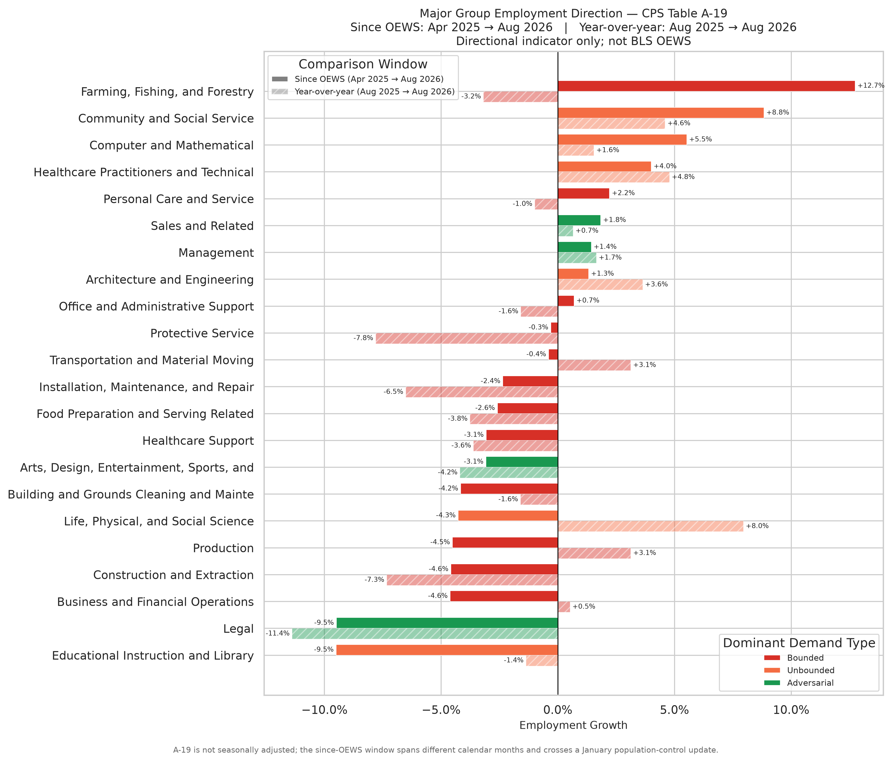

# CPS Employment Direction by Major Group

**File:** `cps_2026_direction.png`

## Data source

BLS Current Population Survey (CPS), Table A-19: *Employed people by occupation, sex, and age* (household data, not seasonally adjusted). The chart uses the **Total (16 years and over)** column.

A-19 is a rolling web table: it always shows the latest reference month and the same month one year earlier, and BLS replaces it in place each month. A single fetch therefore yields only two months. The pipeline accumulates them into `seeds/cps_a19_panel.csv`, and the chart's date range is read from the panel rather than hardcoded — it advances automatically as new releases land.

This is **not** BLS Occupational Employment and Wage Statistics (OEWS). Key differences:

| Dimension | BLS OEWS (pipeline primary) | CPS Table A-19 (this chart) |
|-----------|-----------------------------|-----------------------------|
| Frequency | Annual (May reference month) | Monthly |
| Sample size | ~1.1M employer records | ~60k household interviews |
| Occupation detail | ~830 SOC 6-digit codes | 22 SOC major groups |
| Latest available | May 2025 | August 2026 |
| Seasonally adjusted | n/a (annual) | No |
| Wage data | Yes | No |

## What this chart shows

Each SOC major group gets a pair of bars, colored by its dominant demand type (from `exposure_volume_by_group.csv`):

- **Since OEWS** (solid) — from the last panel month at or before the OEWS reference month through the latest CPS month. Currently **Apr 2025 → Aug 2026**. This is the window the chart exists to show: the stretch of time OEWS does not yet cover.
- **Year-over-year** (hatched) — the latest month against the same month a year earlier. Currently **Aug 2025 → Aug 2026**.

The anchor is deliberately pinned to the OEWS handoff rather than to the earliest month in the panel, so back-filling older CPS history would not silently change what the solid bars mean.

## How to interpret it

Read this as a directional signal — which broad groups are expanding vs. contracting — not as a precise measurement. CPS monthly figures carry sampling error, and changes smaller than ~2% are within the margin of noise for many groups.

**Demand type coloring** reflects whether the group's modeled AI exposure is driven mainly by Bounded (structural displacement), Unbounded (productivity absorption), or Adversarial (arms-race) tasks. If the model is correct, Bounded groups should tend toward contraction and Unbounded/Adversarial groups toward expansion.

**Compare the two bars before drawing conclusions.** Where they disagree, the disagreement is usually the story. Farming, Fishing, and Forestry shows +12.7% since-OEWS against −3.2% year-over-year — an Apr→Aug comparison catching the seasonal agricultural ramp, not a structural shift. Protective Service (−0.3% vs −7.8%) and Production (−4.5% vs +3.1%) diverge in other directions. Where the two bars agree in sign and rough magnitude — Legal, Construction and Extraction, Arts and Media, Healthcare Practitioners, Community and Social Service — the reading is more robust.

## Honest limitations

- **The since-OEWS window is not seasonally adjusted and spans different calendar months.** Apr→Aug picks up seasonal hiring patterns that have nothing to do with AI. The year-over-year window is clean on this point, which is exactly why both are shown.
- **The since-OEWS window crosses a January.** CPS introduces updated population controls with each January release and does not revise prior months, so part of any level change across that boundary is a definitional artifact rather than labor-market movement. A-19's own footnote flags this.
- The CPS captures employed persons, not job postings. A group can grow in employment while productivity-per-worker rises — consistent with either displacement (fewer workers, same output) or expansion (more output, same workers). Direction alone doesn't distinguish.
- CPS occupational coding is coarser than OEWS. "Computer and Mathematical Occupations" includes both software engineers (likely Unbounded, growing) and statistical assistants (likely Bounded, declining). The group average masks divergence within it.
- Roughly a year of CPS data cannot confirm or refute the model's long-run predictions. It is an early-window directional check only.
- CPS occupation coding changed with the 2018 SOC / 2020 Census update, so these categories are not comparable to pre-2020 CPS data. This matters only if the panel is back-filled — see [cps_data_expansion.md](../cps_data_expansion.md).
