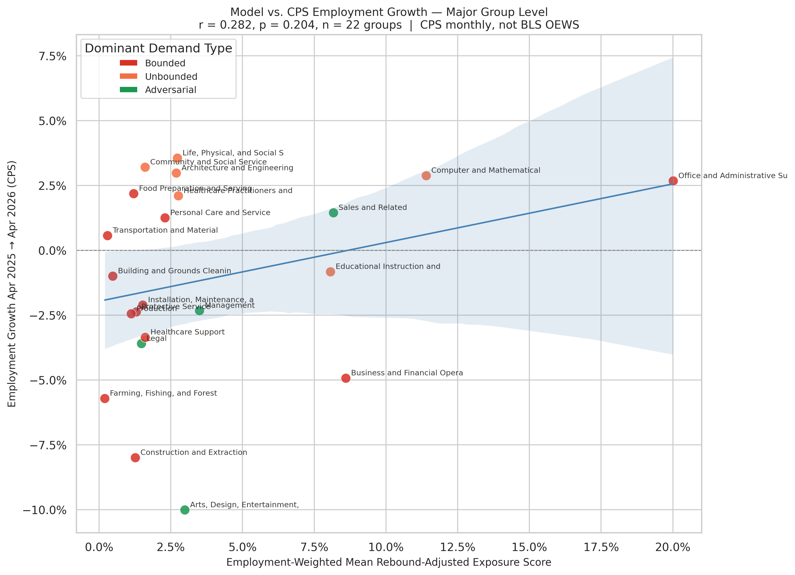
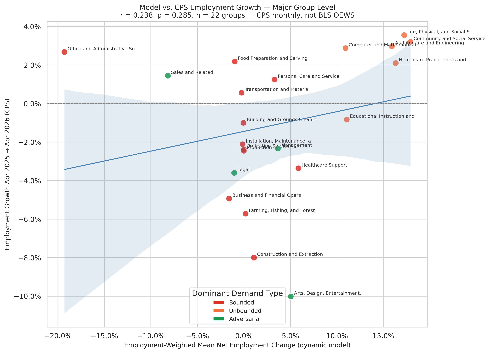

# Model vs. CPS Employment Growth — Major Group Level

Two charts, same layout, different model scores:

- **`cps_rebound_model_vs_actual.png`** — x-axis: employment-weighted mean `occupation_exposure` (rebound-adjusted, gross ≥ 0; correct sign is **negative**)
- **`cps_dynamic_model_vs_actual.png`** — x-axis: employment-weighted mean `net_employment_change` (dynamic model, signed; correct sign is **positive**)





## What these charts show

Each dot is one SOC major occupation group (n = 22). The y-axis is actual employment growth from April 2025 to April 2026, measured by BLS CPS Table A-19 (monthly survey, not BLS OEWS). The x-axis is the model's aggregated prediction for that group.

## How group scores are computed

For each major group:

```
group_score = Σ(model_score × BLS_employment) / Σ(BLS_employment)
```

Employment weights come from the most recent OEWS annual data (`TOT_EMP_25`).

## Current results

| Model | r | p | n | Correct sign? |
|-------|--:|--:|--:|:-------------:|
| Rebound-adjusted | +0.282 | 0.204 | 22 | No (positive, expected negative) |
| Dynamic net change | +0.238 | 0.285 | 22 | Yes (positive, expected positive) |

Neither is statistically significant. The dynamic model's positive r is in the correct direction; the rebound-adjusted model's positive r is the wrong direction for a gross displacement measure at this aggregation level.

## Why the results are weak

**n = 22 has very low statistical power.** A true effect of |r| ≈ 0.2 is undetectable with 22 groups at conventional significance thresholds (need |r| ≳ 0.43 for p < 0.05).

**Group-level aggregation dilutes the signal.** Bounded and Unbounded occupations with opposing displacement trajectories pool within the same major group. "Computer and Mathematical" contains both fast-growing Unbounded roles and shrinking Bounded ones; the aggregate averages them out.

**CPS monthly data has high sampling variance.** Smaller groups (Farming, Legal, Life Science) carry margins of error that can exceed the measured change itself.

**One year is a short window.** Major-group employment is driven by sector-specific confounders (interest rates, post-pandemic normalization, policy changes) that dominate a one-year AI signal.

## Comparison with occupation-level and OEWS sector-level results

The occupation-level rebound-adjusted validation (n ≈ 397, 2024→2025 OEWS) finds r = −0.219 (p < 0.001) — significant because of the larger sample. The dynamic model's sector-level OEWS validation finds r = +0.528 (p = 0.012) at n = 22 sectors — stronger because it uses four years of OEWS data per sector, not a single 12-month CPS window.

These charts are best read as a descriptive extension of the time series — showing the broad 2025–2026 direction by group — rather than as a definitive validation. The OEWS-based charts (see `dynamic_sector_level_employment_validation.md`, `sector_level_employment_validation.md`) are the more reliable test.
