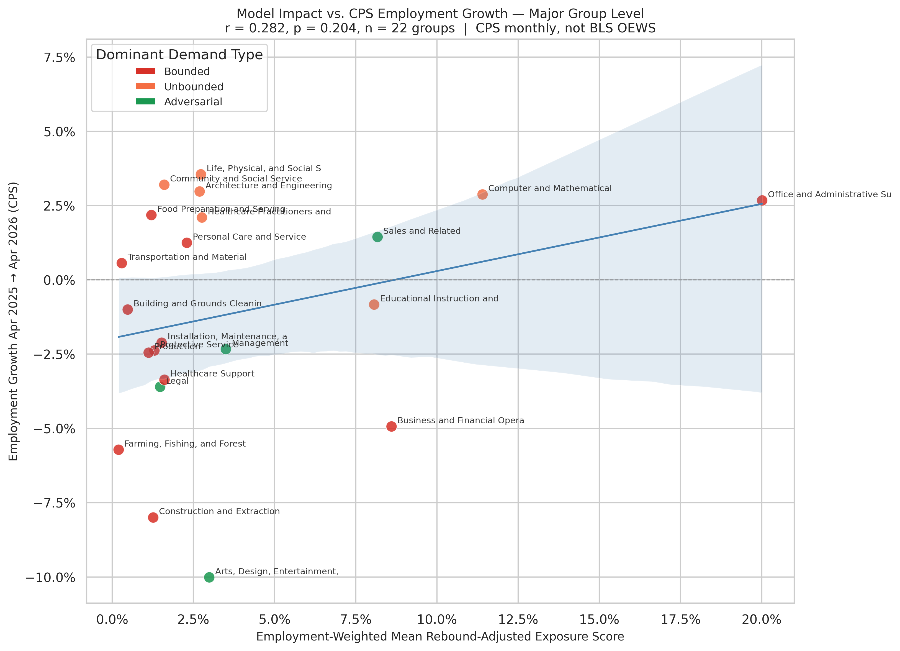

# Model Impact vs. CPS Employment Growth — Major Group Level

**File:** `cps_model_vs_actual.png`



## What this chart shows

Each dot is one SOC major occupation group (n = 22). The x-axis is the employment-weighted mean `occupation_exposure` score for that group — a model prediction of structural structural exposure pressure. The y-axis is actual employment growth in that group from April 2025 to April 2026, measured by BLS CPS Table A-19.

This is a major-group level validation: can the model's aggregated displacement predictions distinguish which broad occupation categories are shrinking vs. growing in 2025–2026?

## How group impact is computed

For each major group:

```
group_impact = Σ(occupation_exposure × BLS_employment) / Σ(BLS_employment)
```

where the sum runs over all occupations in `merged_validation_df` that belong to that 2-digit SOC group. Employment weights come from the most recent OEWS annual data (May 2025 = `TOT_EMP_25`).

## Current result (r = +0.282, p = 0.204, n = 22)

The correlation is not statistically significant. The positive sign (higher model impact → slightly more positive CPS growth) is directionally opposite to the model's prediction. Several honest explanations:

**n=22 has very low statistical power.** With only 22 groups, the threshold for a detectable signal is roughly |r| > 0.4 at p=0.05. A true negative correlation of −0.2 would be invisible here.

**Group-level aggregation dilutes the signal.** Bounded and Unbounded occupations with very different displacement trajectories are pooled within the same major group. "Computer and Mathematical," for example, contains both software engineers (likely growing, Unbounded) and statistical assistants (declining, Bounded). The aggregate averages these opposing signals out.

**CPS monthly data has high sampling variance at group level.** The CPS surveys ~60k households. Estimated changes of a few percent for smaller groups (Farming, Legal, Life Science) carry margins of error that can exceed the measured change itself.

**One year of CPS data is a very short window.** Major-group employment can be driven by seasonal, policy, or macroeconomic shocks unrelated to AI adoption — construction contracting due to interest rates, arts declining due to streaming consolidation, etc. These confounders dominate a one-year signal.

## Comparison with occupation-level results

The occupation-level validation (n ≈ 397 non-zero-penetration occupations) finds r = −0.219 for 2024→2025 BLS OEWS employment growth. That result is statistically significant (p < 0.001) precisely because it has enough occupations to overcome the noise floor. The major-group level CPS comparison has insufficient resolution to replicate or refute that finding.

## What would make this chart more informative

- More years of CPS data would reduce month-to-month noise
- Within-group variance (splitting groups into Bounded vs. non-Bounded sub-groups) would be a stronger test
- Controlling for sector-level confounders (interest rate sensitivity, post-pandemic normalization) would isolate the AI signal

The chart is best read as a descriptive extension of the time series — showing the broad 2025–2026 direction by group — rather than as a validation of the model's predictions.
