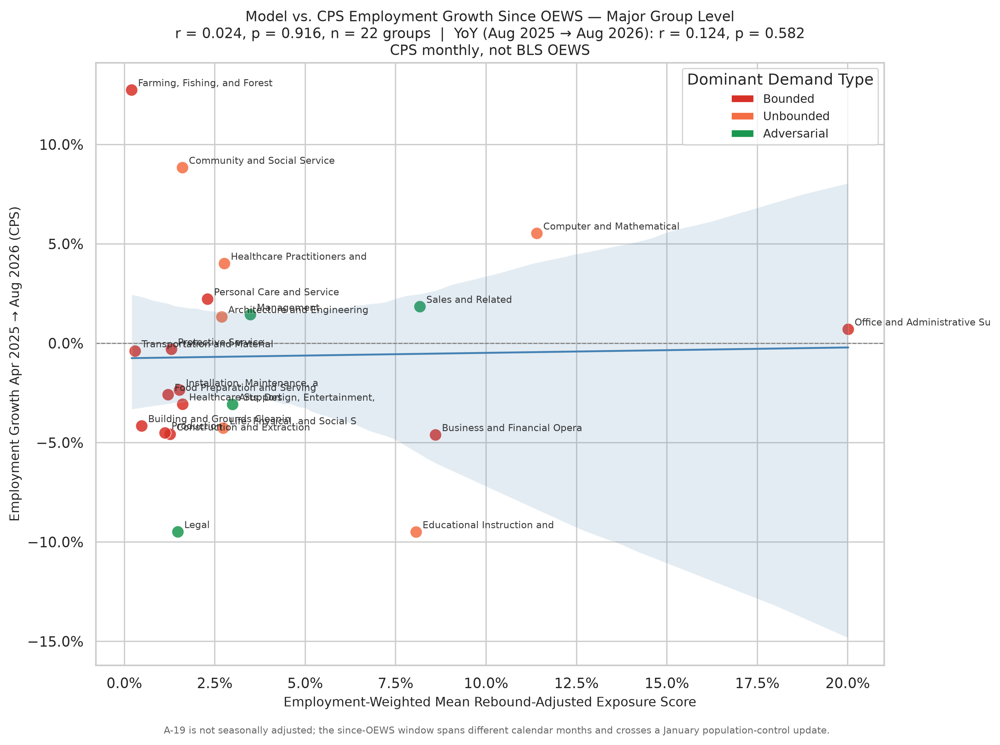
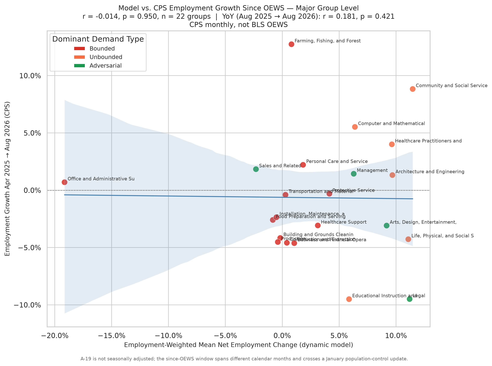

# Model vs. CPS Employment Growth — Major Group Level

Two charts, same layout, different model scores:

- **`cps_rebound_model_vs_actual.png`** — x-axis: employment-weighted mean `occupation_exposure` (rebound-adjusted, gross ≥ 0; correct sign is **negative**)
- **`cps_dynamic_model_vs_actual.png`** — x-axis: employment-weighted mean `net_employment_change` (dynamic model, signed; correct sign is **positive**)





## What these charts show

Each dot is one SOC major occupation group (n = 22). The x-axis is the model's aggregated prediction for that group. The y-axis is actual employment growth from BLS CPS Table A-19 (monthly household survey, not BLS OEWS) over the **since-OEWS** window — currently Apr 2025 → Aug 2026, the stretch OEWS does not yet cover.

The **year-over-year** window (currently Aug 2025 → Aug 2026) is reported in each chart's subtitle rather than plotted separately. It is the seasonally cleaner comparison, so a large gap between the two is a warning that the plotted correlation is picking up seasonality. Both windows are drawn as bars in [cps_2026_direction.md](cps_2026_direction.md).

## How group scores are computed

For each major group:

```
group_score = Σ(model_score × BLS_employment) / Σ(BLS_employment)
```

Employment weights come from the most recent OEWS annual data (the latest `TOT_EMP_*` column, currently `TOT_EMP_25`).

## Current results

Data: CPS A-19 through August 2026; model scores from the current pipeline run.

| Model | Window | r | p | n | Correct sign? |
|-------|--------|--:|--:|--:|:-------------:|
| Rebound-adjusted | Since OEWS (Apr 2025 → Aug 2026) | +0.024 | 0.915 | 22 | No |
| Rebound-adjusted | Year-over-year (Aug 2025 → Aug 2026) | +0.124 | 0.582 | 22 | No |
| Dynamic net change | Since OEWS (Apr 2025 → Aug 2026) | +0.146 | 0.517 | 22 | Yes (positive, expected positive) |
| Dynamic net change | Year-over-year (Aug 2025 → Aug 2026) | **+0.482** | **0.023** | 22 | Yes (positive, expected positive) |

**One result is now conventionally significant: the dynamic model's year-over-year r = +0.482 (p = 0.023).** It has the correct sign, it sits on the seasonally cleaner of the two windows, and it is consistent in both sign and rough magnitude with the dynamic model's OEWS sector-level result (r = +0.528, p = 0.012). Two independent datasets — an employer survey and a household survey — pointing the same way at the same magnitude is a meaningfully better showing than either alone.

It is still one underpowered test at n = 22, and the significance is not robust: it emerged only with the August 2026 release. The two-month-earlier vintage of this same table (CPS through June 2026) gave r = +0.370 (p = 0.090) for this row, and the June vintage's since-OEWS window carried the opposite sign (r = −0.125). A result that moves that much on a two-month shift in endpoints is not yet a stable finding. Treat it as the hypothesis worth tracking across the next few releases, not as confirmation.

**The rebound-adjusted model has no support here, and its sign is wrong on both windows.** Its correct sign is negative; both windows return small positive correlations. Neither is anywhere near significant (p = 0.92 and p = 0.58), so this is best read as no signal rather than as evidence against — but it is the second consecutive vintage in which the rebound-adjusted score fails to separate groups the way the dynamic score does.

## Why the results are weak

**n = 22 has very low statistical power.** A true effect of |r| ≈ 0.2 is undetectable with 22 groups at conventional thresholds (need |r| ≳ 0.43 for p < 0.05). Adding CPS months does not help: n is the number of major groups, not the number of observations.

**Group-level aggregation dilutes the signal.** Bounded and Unbounded occupations with opposing trajectories pool within the same major group. "Computer and Mathematical" contains both fast-growing Unbounded roles and shrinking Bounded ones; the aggregate averages them out.

**CPS monthly data has high sampling variance.** Smaller groups (Farming, Legal, Life Science) carry margins of error that can exceed the measured change itself.

**The since-OEWS window is not seasonally adjusted.** It spans Apr→Aug and crosses a January population-control update. Farming, Fishing, and Forestry at +12.7% over that window against −3.2% year-over-year is the clearest illustration — a seasonal agricultural ramp, not a structural shift. This is the likeliest reason the since-OEWS row stays flat (r = +0.146) while the year-over-year row does not.

**The window is short.** Major-group employment is driven by sector-specific confounders (interest rates, post-pandemic normalization, policy changes) that dominate a roughly one-year AI signal.

## Comparison with occupation-level and OEWS sector-level results

The occupation-level rebound-adjusted validation (n ≈ 397, 2024→2025 OEWS) finds r = −0.219 (p < 0.001) — significant because of the larger sample. The dynamic model's sector-level OEWS validation finds r = +0.528 (p = 0.012) at n = 22 sectors — stronger because it uses four years of OEWS data per sector, not a single short CPS window.

These charts are best read as a descriptive extension of the time series — showing the broad direction by group since OEWS ends — rather than as a validation, notwithstanding the dynamic model's year-over-year result above. The OEWS-based charts ([dynamic_sector_level_employment_validation.md](dynamic_sector_level_employment_validation.md), [sector_level_employment_validation.md](sector_level_employment_validation.md)) remain the more reliable test.
