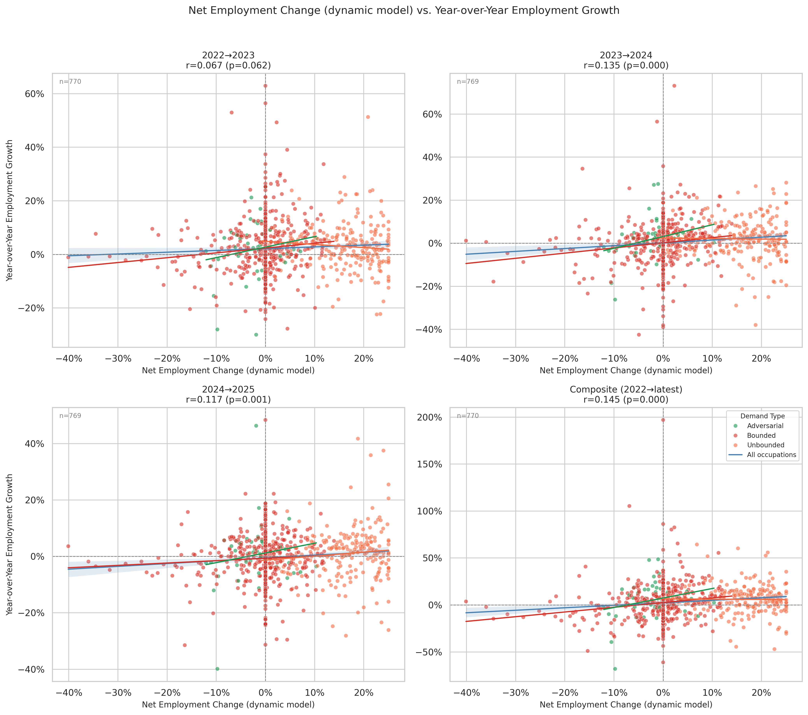
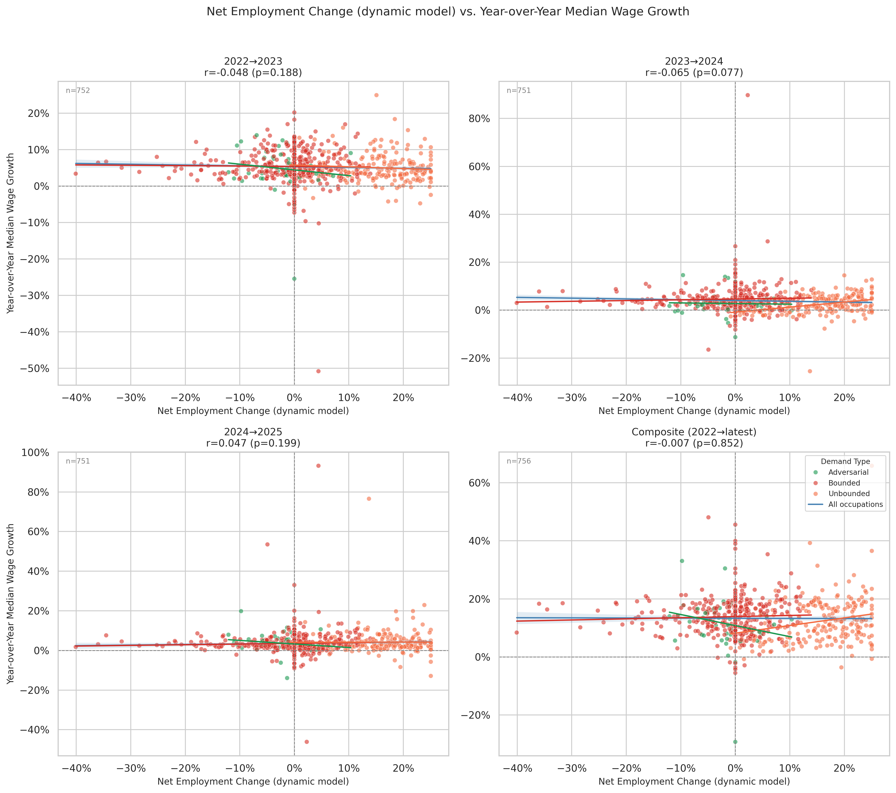
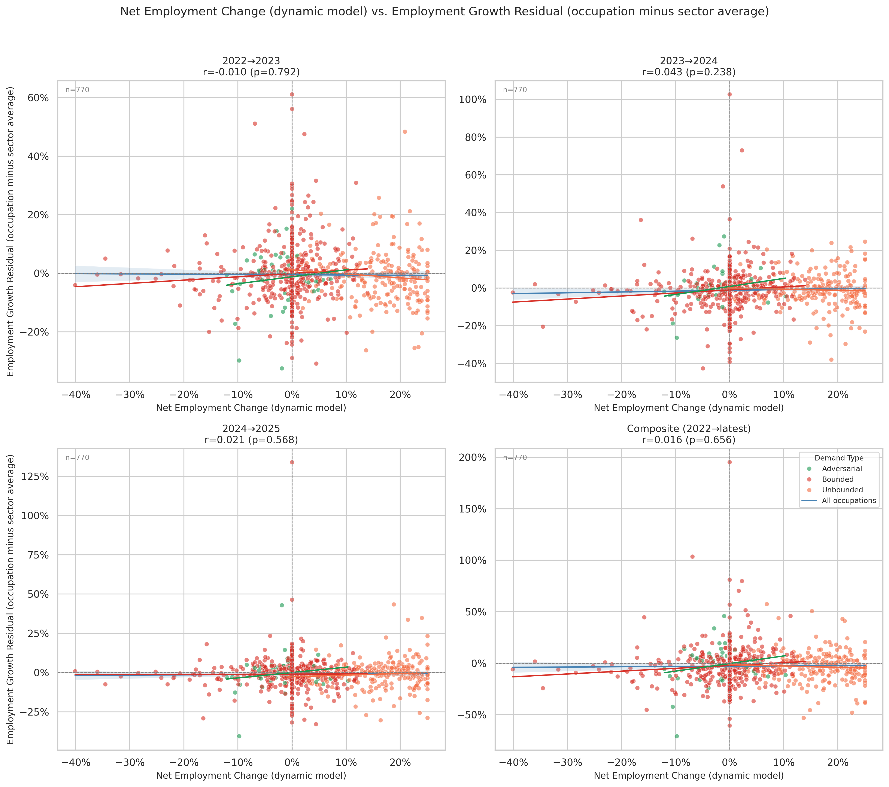
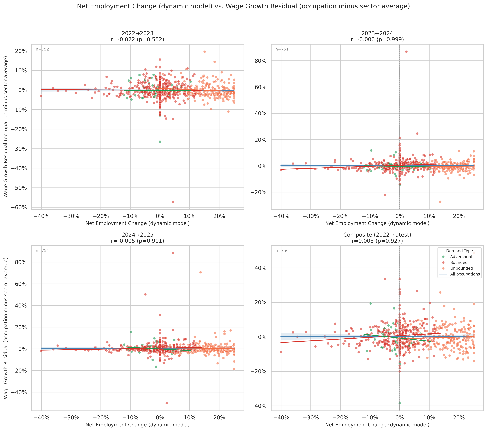

# Dynamic Model: Growth Validation (Raw and Sector-Adjusted)

**Files:**
- `dynamic_model_vs_actual_employment_growth.png`
- `dynamic_model_vs_actual_wage_growth.png`
- `dynamic_model_sector_adjusted_employment_growth.png`
- `dynamic_model_sector_adjusted_wage_growth.png`

## What these charts show

These four charts are the dynamic model analogs of `model_vs_actual_employment_growth.png` and `sector_adjusted_employment_growth.png`. Each is a 2×2 grid of scatter plots, one panel per BLS period (2022→23, 2023→24, 2024→25, composite). The x-axis in all four is the dynamic model's `net_employment_change`; the y-axis is either raw BLS growth or the sector-adjusted residual.

See `sector_adjusted_growth.md` for an explanation of how sector adjustment is computed.

## Raw employment growth: positive and significant

| Period | r | p |
|--------|---|---|
| 2022→2023 | +0.067 | 0.062 |
| 2023→2024 | +0.135 | 0.000 |
| 2024→2025 | +0.117 | 0.001 |
| Composite | +0.145 | 0.000 |

The dynamic model has a statistically significant positive correlation with actual employment growth in three of four periods and in the composite. This is a sign flip relative to the rebound-adjusted model, which showed negative correlations (composite r = −0.089). Higher dynamic net employment change (more absorption relative to displacement) predicts higher actual employment growth in the BLS data.

## Sector-adjusted employment growth: signal collapses to zero

| Period | r | p |
|--------|---|---|
| 2022→2023 | +0.010 | 0.792 |
| 2023→2024 | +0.043 | 0.238 |
| 2024→2025 | +0.021 | 0.568 |
| Composite | +0.016 | 0.656 |

Once sector-level employment trends are removed, the dynamic model's correlation drops to near zero across all periods. None are significant. This diagnostic is definitive: **the dynamic model's positive raw correlation with employment growth is entirely explained by sector composition, not occupation-specific dynamics**.

Unbounded-dominant sectors (Computer and Mathematical, Healthcare Practitioners, Community and Social Service) grew faster than Bounded-dominant sectors (Office and Administrative, Clerical, Farming) over 2022–2025. The model correctly predicts positive net change for Unbounded sectors and negative net change for Bounded sectors, so it appears predictive in the raw charts. But within any single sector, the model does not distinguish fast-growing from slow-growing occupations — the sector-adjusted null confirms this.

## Wage growth: no signal at any level

| Period | Raw r | Sector-adj r |
|--------|-------|-------------|
| 2022→2023 | +0.048 | +0.022 |
| 2023→2024 | −0.065 | −0.000 |
| 2024→2025 | +0.047 | −0.005 |
| Composite | +0.007 | +0.003 |

Neither raw nor sector-adjusted wage growth shows any relationship with the dynamic model's predictions. The rebound-adjusted model had a weak but consistent negative wage signal (composite r = −0.097, p = 0.008) that the dynamic model does not replicate.

## Interpreting the occupation-level null

The collapse of the employment signal after sector adjustment reveals a structural limitation of the dynamic model's absorption mechanism. Because every occupation in a sector absorbs the same rate of displaced labor (proportional to its `pct_unbounded`), all occupations within a sector receive nearly uniform absorption estimates. Any occupation-specific variation in `net_employment_change` within a sector comes only from differences in `bounded_exposure_contribution` — which is a smoothed, time-averaged signal from AI penetration data, not a real-time growth predictor.

The sector-adjusted null does not mean the model is wrong about the direction of long-run labor reallocation. It means the model's current absorption mechanism is too coarse to produce occupation-level predictions that outperform the sector trend alone.

The sector-level charts are where the model's predictive content surfaces. `dynamic_sector_level_validation.md` covers the composite view (r = +0.528, p = 0.012); `dynamic_sector_level_employment_validation.md` shows the per-year breakdown, where the 2023→24 and 2024→25 panels each reach r ≈ +0.53 (p < 0.02). The raw occupation-level positive correlations documented above exist because the model correctly separates Unbounded-dominant sectors from Bounded-dominant ones — the sector effects that the sector-adjusted charts strip out are the model's actual signal.
