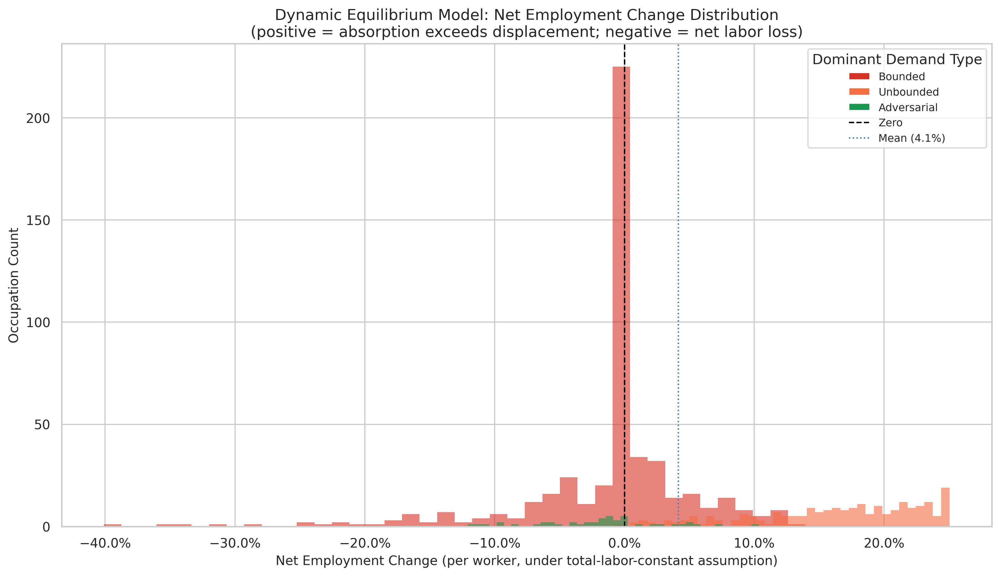

# Dynamic Model: Net Employment Change Distribution

**File:** `dynamic_model_net_change_distribution.png`

## What this chart shows

Each bar is one occupation. The x-axis is the dynamic model's `net_employment_change` — the signed per-worker net labor flow under the economy-wide conservation constraint. Bars are colored by the occupation's dominant demand type. The dashed vertical line marks zero (no net change); the dotted line marks the economy-wide mean.

## Why the distribution is asymmetric

The distribution has a pronounced spike near zero and long tails in both directions. This shape is a direct consequence of model structure:

**The spike:** Most Bounded occupations have very low AI penetration — their gross displacement is near zero, and since they have little Unbounded capacity, their absorption is also near zero. Several hundred occupations accumulate at roughly 0%.

**The left tail:** A small number of heavily-penetrated Bounded occupations (Medical Records Specialists, Office Clerks, Customer Service Representatives) carry large gross displacement that is not offset by any Unbounded absorption. These generate the long left tail reaching −40%.

**The right tail:** Pure Unbounded occupations (Nurse Midwives, Cardiologists, Computer Programmers) absorb displaced labor in proportion to their total employment, producing a spread of positive values. The ceiling around +25% is a model ceiling: any occupation with `pct_unbounded ≈ 1` and near-zero displacement receives the same absorption rate — `total_displaced / employment_weighted_avg_pct_unbounded` — so they converge.

## The mean (+4.1%) is not the typical outcome

The mean is pulled rightward by the Unbounded tail. The median is closer to zero. Most occupations experience near-zero net change; the distribution is better summarized by its shape than its mean.

## Comparison to the rebound-adjusted model's distribution

The rebound-adjusted exposure model produces only non-negative values: its distribution is right-skewed with a spike at zero and a right tail. The dynamic model's distribution is two-tailed — it explicitly assigns negative net change to the high-displacement Bounded occupations that the rebound model identified as structurally exposed. The two models agree on which occupations are at risk; they disagree on whether that risk is expressed as a large positive exposure score (rebound model) or a large negative employment change (dynamic model).
