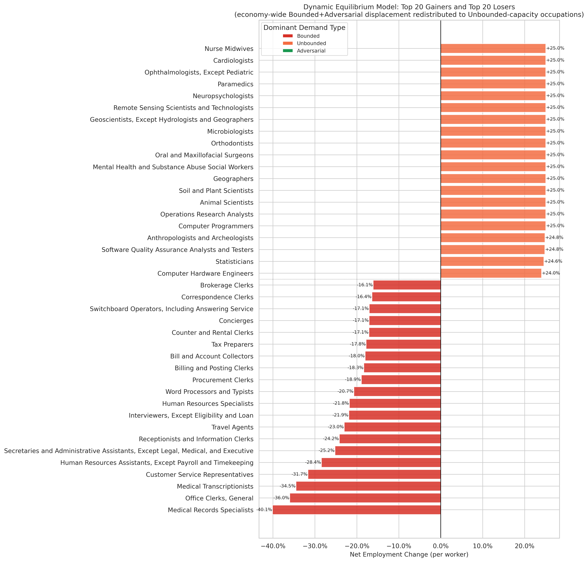

# Dynamic Model: Top 20 Gainers and Top 20 Losers

**File:** `dynamic_model_winners_losers.png`

## What this chart shows

The top half shows the 20 occupations with the largest positive `net_employment_change` under the dynamic equilibrium model — occupations that absorb more displaced labor than they shed. The bottom half shows the 20 occupations with the most negative net change — those that shed more than they absorb. Bars are colored by dominant demand type.

## The split is categorical

Every gainer is Unbounded; every loser is Bounded. There are no mixed cases in the top 40. This is a structural consequence of the model: Unbounded occupations contribute zero gross displacement (their Adversarial and Bounded contributions are zero by definition of being Unbounded-dominant), so their net change equals their absorption. Bounded occupations contribute large gross displacement and, having low `pct_unbounded`, absorb very little.

## Losers: administrative and clerical work under concentrated pressure

The bottom 20 are dominated by administrative, clerical, and support occupations:

- **Medical Records Specialists** (−40%), **Office Clerks** (−36%), **Medical Transcriptionists** (−35%): The three occupations with the highest rebound-adjusted exposure scores. Their tasks are highly Bounded, heavily AI-penetrated, and carry large workforces — the model assigns them the most concentrated displacement.
- **Customer Service Representatives** (−31%), **Human Resources Assistants** (−29%), **Secretaries and Administrative Assistants** (−25%): High-volume occupations where routine task automation is already active according to the penetration data.

These occupations also top the `highest_exposure_occupations.png` chart. The two models agree on who is most at risk; they express it differently (exposure score vs. signed employment change).

## Gainers: healthcare specialists and scientists

The top 20 are dominated by healthcare specialists, scientists, and mathematical occupations — Nurse Midwives, Cardiologists, Ophthalmologists, Paramedics, Microbiologists, Neuropsychologists, Computer Programmers, Operations Research Analysts. Nearly all show approximately the same +25% gain.

The convergence to a common ceiling is a model artifact: any occupation with `pct_unbounded ≈ 1` receives the same absorption rate. The model does not distinguish between a Cardiologist and a Computer Programmer when distributing displaced labor — both have near-total Unbounded capacity, so both get the same rate.

## A key interpretive limitation

The model sends displaced administrative clerks to Nurse Midwives and Cardiologists by the conservation constraint. The math is correct under the model's assumptions, but the implied labor reallocation is not economically plausible over any near-to-medium term horizon: workers displaced from medical records transcription cannot retrain as surgeons. The absorption mechanism distributes displaced labor in proportion to total Unbounded headcount, not skill adjacency. A future version of the model would weight absorption by retraining feasibility or occupational proximity, which would dampen the gains for high-credential Unbounded occupations and increase them for Unbounded occupations that are more accessible to displaced workers.
