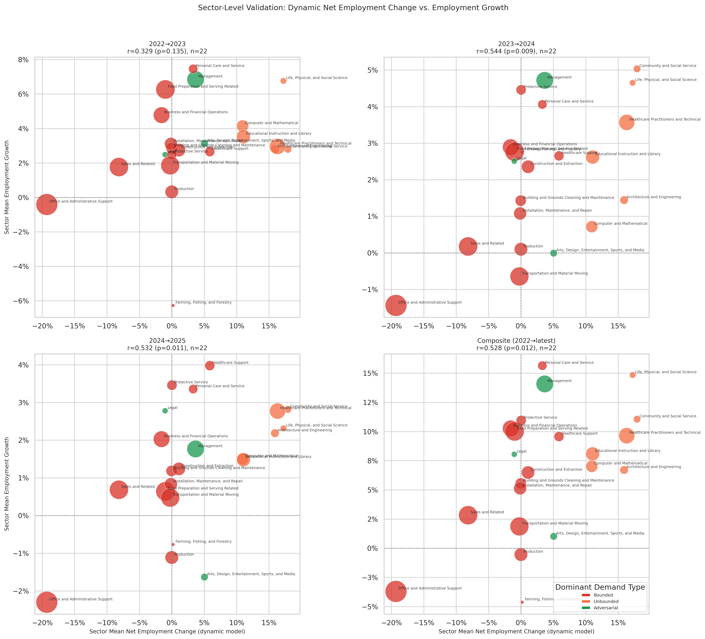

# Dynamic Model: Sector-Level Employment Validation (Per Year)

**File:** `dynamic_sector_level_employment_validation.png`

## What this chart shows

Each bubble is one BLS major occupational group. The x-axis is the sector's employment-weighted mean `net_employment_change` from the dynamic equilibrium model; the y-axis is that sector's mean BLS employment growth for the given period. Bubble size scales with total sector employment. The four panels cover each year-over-year period plus the composite.

This is the per-period expansion of the composite panel in `dynamic_sector_level_validation.png`.

## Correlation by period

| Period | r | p |
|--------|---|---|
| 2022→2023 | +0.329 | 0.135 |
| 2023→2024 | +0.544 | 0.009 |
| 2024→2025 | +0.532 | 0.011 |
| Composite | +0.528 | 0.012 |

## Key observations

**Consistent positive signal across all periods, statistically significant in three of four.** The dynamic model predicts that sectors with higher employment-weighted net employment change (more Unbounded absorption than Bounded/Adversarial displacement) grow more. The BLS data supports this at the sector level.

**The signal strengthens over time.** The 2022→23 period has the weakest correlation (r = +0.329, p = 0.135), not significant at α = 0.05. By 2023→24 the r jumps to +0.544 (p = 0.009) and holds through 2024→25 (r = +0.532, p = 0.011). This temporal pattern is consistent with AI adoption having an increasing effect on sector-level employment outcomes over the observation window — the model's predictions become more accurate as AI-driven labor reallocation becomes more visible in BLS data.

**Unbounded-dominant sectors drive the upper-right.** Across all four panels, the sectors in the upper-right (positive net change, positive actual growth) are consistently the Unbounded-dominant ones: Computer and Mathematical, Healthcare Practitioners, Community and Social Service, Life/Physical/Social Science. These are the sectors the model assigns the largest absorption benefit and which BLS shows growing the fastest.

**Bounded-dominant sectors cluster in the lower-left.** Farming/Forestry, Construction, Business and Financial Operations, and Office and Administrative Support appear in the left or lower portions of the scatter in most panels.

**Office and Administrative Support: the key exception.** This sector has a large negative dynamic net employment change (large Bounded displacement, low Unbounded absorption) but showed modest actual employment growth in 2023→24 and 2024→25. It sits below the regression line in later panels, pulling r down. The model may be overestimating Bounded displacement in this sector, or near-term employment there is being sustained by factors outside the model's scope — for instance, AI implementation itself may be driving hiring of workers to manage AI tools.

## Comparison to the rebound model

The rebound model's sector employment correlations are non-significant and weaker across all periods (r ranging from +0.043 to −0.412). The dynamic model's consistent positive signal in 2023→24, 2024→25, and composite (all r ≈ +0.53, p < 0.02) represents a substantially better fit to observed sector-level employment outcomes. The key difference: the dynamic model explicitly models where displaced workers go (into Unbounded sectors), while the rebound model only measures displacement pressure. At the sector level, where labor actually flows is observable in BLS data, giving the dynamic model a real advantage.
