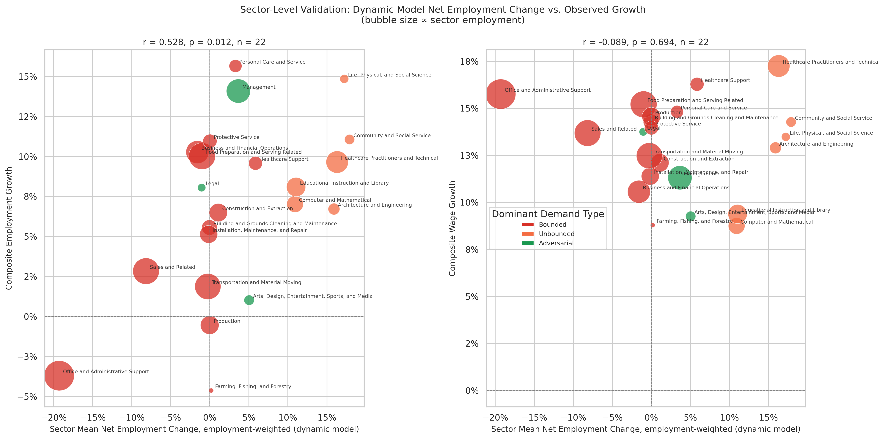

# Dynamic Model: Sector-Level Validation

**File:** `dynamic_sector_level_validation.png`

## What this chart shows

Each bubble is one of the 22 BLS major occupational groups. The x-axis is the sector's employment-weighted mean `net_employment_change` from the dynamic model. The y-axis is the sector's composite employment growth (left panel) or composite wage growth (right panel) from BLS OEWS data. Bubble size scales with total sector employment.

This is the direct analog of `sector_level_validation.png` for the dynamic model.

## Correlation results

**Employment (left panel):** r = +0.528, p = 0.012, n = 22.

This is the strongest sector-level validation result in the pipeline. Higher dynamic model net employment change predicts higher actual composite employment growth across BLS major groups, and the relationship is statistically significant. The positive slope is clearly visible in the chart: sectors in the upper-right (high net change, strong growth) are the Unbounded-dominant ones; sectors in the lower-left (negative net change, weaker growth) are Bounded-dominant.

**Wage (right panel):** r = −0.089, p = 0.694, n = 22.

No relationship with wage growth. The model has no wage signal at any aggregation level.

## Comparison to the rebound-adjusted model

| Model | Sector emp r | p | Sector wage r | p |
|-------|-------------|---|---------------|---|
| Rebound-adjusted | −0.247 | 0.267 | −0.086 | 0.704 |
| Dynamic equilibrium | +0.528 | 0.012 | −0.089 | 0.694 |

The dynamic model's sector employment correlation (r = +0.528) is substantially stronger than the rebound-adjusted model's (r = −0.247), and the sign is correct: Unbounded sectors grew more, not less, over 2022–2025. The rebound-adjusted model assigns its highest scores to Bounded occupations (those under the most displacement pressure), which are concentrated in sectors that grew slowly — producing a negative but insignificant correlation with actual growth.

## What drives the positive employment correlation

The key sectors populating the upper-right of the employment panel are:

- **Computer and Mathematical** (large bubble): High `pct_unbounded`, low Bounded displacement → large positive net change; actual growth was among the highest.
- **Healthcare Practitioners and Technical**: Similar structure. Healthcare grew through the period.
- **Community and Social Service**, **Life, Physical, and Social Science**, **Architecture and Engineering**: All Unbounded-dominant, all show positive actual growth.

Sectors in the lower-left include:

- **Office and Administrative Support** (large bubble, negative net change): The largest single source of Bounded displacement in the model; grew modestly in BLS data but at a lower rate than Unbounded sectors.
- **Arts, Design, Entertainment, Sports, and Media**: Adversarial-dominant, near-zero net change; mixed actual growth performance.
- **Farming, Fishing, and Forestry**: Bounded, small negative net change; weak actual growth.

**Office and Administrative Support** is the most important outlier: the model assigns it a large negative net employment change (−10% to −15%), but BLS data shows it growing modestly (+2.7% Apr 2025 over Apr 2025, per CPS). This tension is the clearest candidate for further investigation — either the model overestimates Bounded displacement in this sector, or employment growth there is being sustained by factors outside the model's scope (e.g., near-term hiring driven by AI implementation itself).

## Relationship to occupation-level null

The sector-level r = +0.528 coexists with occupation-level sector-adjusted r ≈ 0.01–0.02 (see `dynamic_model_growth_validation.md`). This combination means: the model correctly identifies which sectors gained or lost labor, but within any sector it cannot distinguish which specific occupations outperformed their peers. The sector-level signal is real; the occupation-level signal is not yet detectable.

This is the expected pattern for a model that redistributes labor via sector-level Unbounded capacity rather than occupation-specific adjacency. Strengthening the occupation-level prediction would require a more granular absorption mechanism that routes displaced workers toward skill-adjacent Unbounded occupations rather than all Unbounded occupations proportionally.
