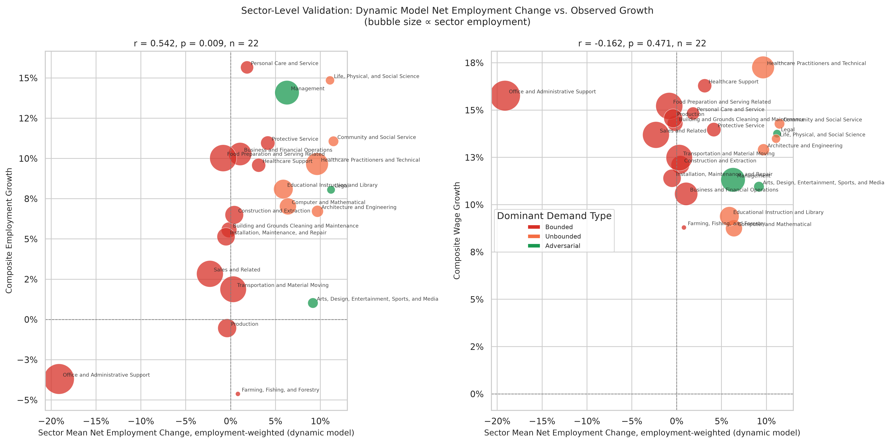

# Dynamic Model: Sector-Level Validation

**File:** `dynamic_sector_level_validation.png`

## What this chart shows

Each bubble is one of the 22 BLS major occupational groups. The x-axis is the sector's employment-weighted mean `net_employment_change` from the dynamic model. The y-axis is the sector's composite employment growth (left panel) or composite wage growth (right panel) from BLS OEWS data. Bubble size scales with total sector employment.

This is the direct analog of `sector_level_validation.png` for the dynamic model.

## Composite correlation results

**Employment (left panel):** r = +0.542, p = 0.009, n = 22. Leave-one-sector-out range +0.375 to +0.618 — see [Which sector carries it](#which-sector-carries-it).

This is the strongest sector-level validation result in the pipeline. Higher dynamic model net employment change predicts higher actual composite employment growth across BLS major groups, and the relationship is statistically significant. The positive slope is clearly visible in the chart: sectors in the upper-right (high net change, strong growth) are the Unbounded-dominant ones; sectors in the lower-left (negative net change, weaker growth) are Bounded-dominant.

**Wage (right panel):** r = −0.162, p = 0.471, n = 22.

No relationship with wage growth. The model has no wage signal at any aggregation level.

## Per-year breakdown

The composite masks variation across years. See `dynamic_sector_level_employment_validation.png` and `dynamic_sector_level_wage_validation.png` for the full per-period grids.

### Employment correlations by period

| Period | r | p |
|--------|---|---|
| 2022→2023 | +0.333 | 0.129 |
| 2023→2024 | +0.570 | 0.006 |
| 2024→2025 | +0.571 | 0.006 |
| Composite | +0.542 | 0.009 |

The signal is positive in all four periods and statistically significant in three of four. The strengthening from 2022→23 (r = +0.333, p = 0.129) to 2023→24 (r = +0.570, p = 0.006) is consistent with AI adoption having an increasing effect on sector-level employment outcomes — but see the confound note below before treating this as specifically AI-attributable.

### Wage correlations by period

| Period | r | p |
|--------|---|---|
| 2022→2023 | −0.180 | 0.422 |
| 2023→2024 | −0.213 | 0.342 |
| 2024→2025 | +0.163 | 0.469 |
| Composite | −0.163 | 0.468 |

Small, mixed in sign, and never significant. See `dynamic_sector_level_wage_validation.md` for interpretation.

## Comparison to the rebound-adjusted model

| Period | Rebound emp r | p | Dynamic emp r | p |
|--------|--------------|---|---------------|---|
| 2022→2023 | +0.043 | 0.850 | +0.333 | 0.129 |
| 2023→2024 | −0.412 | 0.057 | +0.570 | 0.006 |
| 2024→2025 | −0.347 | 0.313 | +0.571 | 0.006 |
| Composite | −0.247 | 0.267 | +0.542 | 0.009 |

The dynamic model outperforms the rebound model at the sector level in every period. The sign reversal in 2023→24 and 2024→25 is particularly striking: the rebound model predicts that high-exposure sectors (Bounded-dominant) grow less, while the dynamic model predicts that net-gaining sectors (Unbounded-dominant) grow more. The BLS data consistently supports the dynamic model's direction.

## What drives the positive employment correlation

The key sectors populating the upper-right of the employment panels are:

- **Computer and Mathematical** (large bubble): High `pct_unbounded`, low Bounded displacement → large positive net change; actual growth was among the highest across all periods.
- **Healthcare Practitioners and Technical**: Similar structure. Healthcare grew steadily through the period.
- **Community and Social Service**, **Life, Physical, and Social Science**, **Architecture and Engineering**: All Unbounded-dominant, all showing positive actual growth.

Sectors in the lower-left include:

- **Office and Administrative Support** (large bubble, negative net change): The largest single source of Bounded displacement in the model. It grew modestly in BLS data but at a lower rate than Unbounded sectors — appearing consistently below the regression line.
- **Arts, Design, Entertainment, Sports, and Media**: Adversarial-dominant, near-zero net change; mixed actual growth performance.
- **Farming, Fishing, and Forestry**: Bounded, small negative net change; weak actual growth.

**Office and Administrative Support** is not an outlier but the anchor of the result. The model assigns it the most negative sector score in the economy (about −19%), and it is the only large sector with negative composite employment growth (−3.7%, down from 19.96M workers in 2016 to 17.75M in 2025). It sits alone in the lower-left, which is what gives the fitted line most of its slope.

## Which sector carries it

`compute_sector_jackknife` drops each sector in turn and recomputes the composite correlation (`data/output/sector_jackknife.csv`):

| Dropped sector | r | p |
|---|---:|---:|
| Office and Administrative Support | +0.375 | 0.094 |
| Life, Physical, and Social Science | +0.501 | 0.021 |
| Community and Social Service | +0.523 | 0.015 |
| Sales and Related | +0.529 | 0.014 |
| *(18 others)* | +0.53 to +0.60 | ≤ 0.013 |
| Arts, Design, Entertainment, Sports, and Media | +0.618 | 0.003 |

Removing Office and Administrative Support is the only single deletion that takes the result above p = 0.05. A correlation on 22 points with one point far from the rest is partly a measurement of that point, so the headline r should be quoted with its jackknife range beside it. That said, clerical work is exactly where the model's mechanism is most visible — high penetration, almost entirely Bounded, employment falling since 2016 — so its influence is the finding, not a nuisance.

## Relationship to occupation-level null

The sector-level r = +0.542 coexists with occupation-level sector-adjusted r ≈ 0.03–0.06 (see `dynamic_model_growth_validation.md`). This combination means: the model correctly identifies which sectors gained or lost labor, but within any sector it cannot distinguish which specific occupations outperformed their peers. The sector-level signal is real; the occupation-level signal is not yet detectable.

This is the expected pattern for a model that redistributes labor via sector-level absorption capacity rather than occupation-specific adjacency. Strengthening the occupation-level prediction would require a more granular absorption mechanism that routes displaced workers toward skill-adjacent Unbounded occupations rather than all Unbounded occupations proportionally.

## The result does not rest on the conservation constraint

A natural objection to r = +0.542 is that it is an artifact of assuming total
employment is conserved. It is not. The conservation constraint reduces to a
single scalar multiplying `absorption_capacity`, and re-running this correlation across
a range of equilibration rates shows the result holds anywhere from a quarter to
a hundred times the conserved value (all p < 0.05). The one point that fails is
multiplier 0 — the no-equilibrium model in which displaced labor vanishes, which
drops to r = +0.335 (p = 0.127).

That is the comparison the dynamic model exists to make, so it is worth stating
directly: **the naive no-equilibrium assumption is the worst-fitting point on the
curve, and the only one that loses significance.** See `framework.md`
§ Robustness to the equilibration rate for the full sweep, and
`data/output/equilibration_sensitivity.csv` for the generated table.

## Confound: pre-existing sector composition

Extending the BLS baseline to 2005 (see `model_signal_over_time.md`) reveals that the dynamic model's sector-level r was already r ≈ +0.43–0.48 in 2005→06 and 2006→07, well before meaningful AI adoption. Unbounded sectors — Computer and Mathematical, Healthcare, Life Sciences — have grown faster than Bounded sectors as part of a long-running secular shift in the economy. The model, which assigns positive `net_employment_change` to Unbounded-heavy sectors, therefore partly captures a pre-existing structural tendency.

The AI-era values (r ≈ +0.57 in 2023→24 and 2024→25) are modestly above the pre-AI peak of +0.45–0.48, consistent with AI accelerating the redistribution. But three post-AI years (2022→25) is insufficient to cleanly separate amplification from the baseline trend. The claim that this signal reflects AI effects specifically is weakened by the pre-AI baseline; a stronger test requires more post-AI data.

**The rebound-adjusted model is not subject to this confound.** Its r fluctuates near zero or weakly positive throughout 2005–2021 (the wrong sign for a gross displacement measure), then turns negative in 2023→24. That negative signal has no pre-AI analog and is more specifically attributable to AI-era structural pressure. Definitive AI attribution for the dynamic model's sector signal requires OEWS 2025→2026 annual data, which is not yet available.
