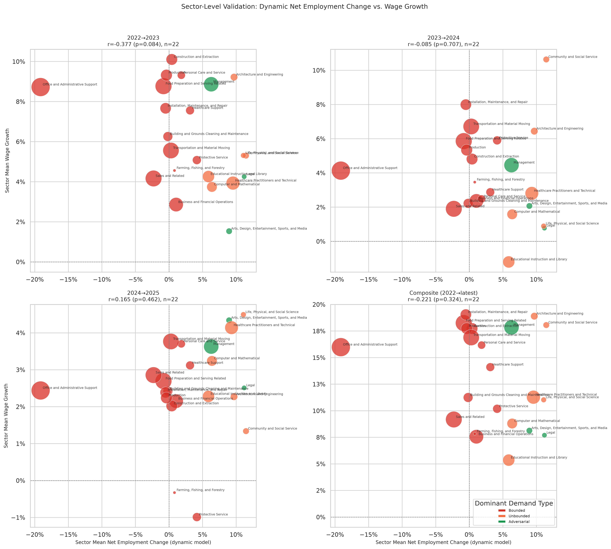

# Dynamic Model: Sector-Level Wage Validation (Per Year)

**File:** `dynamic_sector_level_wage_validation.png`

## What this chart shows

Same layout as `dynamic_sector_level_employment_validation.png` but with the growth of each major group's median wage (from `bls_sector_trends.csv`) on the y-axis. Four panels: 2022→23, 2023→24, 2024→25, composite.

## Correlation by period

| Period | r | p |
|--------|---|---|
| 2022→2023 | −0.379 | 0.082 |
| 2023→2024 | −0.087 | 0.702 |
| 2024→2025 | +0.169 | 0.451 |
| Composite | −0.222 | 0.320 |

## Key observations

**No wage signal at any level.** No period reaches significance; the closest is 2022→23 (r = −0.379, p = 0.082), which is the post-COVID catch-up in physical and care sectors that the model scores as neither gainers nor losers. The dynamic model, which has strong predictive content for sector-level employment growth, has essentially no relationship with sector-level wage growth.

**The direction contrast with employment is striking.** The employment validation shows r ≈ +0.5 (p < 0.05) in recent periods; the wage validation never reaches significance. The same model that tracks labor flows between sectors does not track how those flows affect wages within sectors. This suggests that sector-level wage growth is determined by factors orthogonal to AI-driven labor reallocation — tight labor markets, minimum wage changes, sector-specific bargaining dynamics — rather than by the mix of demand types in that sector.

**Why wage and employment diverge.** Under the dynamic model's conservation assumption, displaced workers move from Bounded sectors to those with Unbounded or Adversarial capacity. If this reallocation is happening in reality, those sectors should see both higher employment and potentially wage pressure in either direction (wages could rise with demand or fall as labor supply increases). The absence of a wage signal suggests that wage-setting mechanisms in absorbing sectors are not closely coupled to labor inflows from Bounded sectors — at least not over a 3-year window.

## Comparison to the rebound model

The rebound model's sector wage correlations (`sector_level_wage_validation.png`) are also non-significant. Raw observed coverage, by contrast, does correlate with sector median-wage growth (composite r = −0.50, p = 0.017) — see `anthropic_observed_sector_level_wage_validation.md`. Neither model has detectable sector-level wage signal. Both models agree on employment at the sector level while both fail to explain wage growth.
