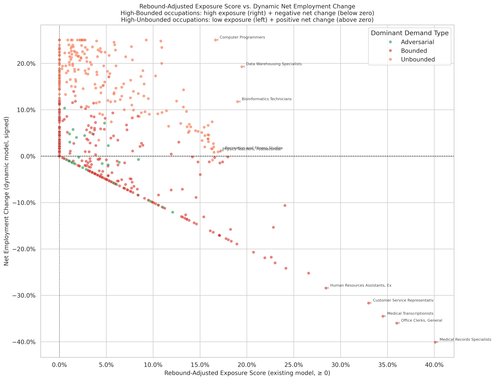

# Rebound-Adjusted Exposure Score vs. Dynamic Net Employment Change

**File:** `dynamic_vs_rebound_model_comparison.png`

## What this chart shows

Each dot is one BLS-matched occupation. The x-axis is the rebound-adjusted exposure score from the existing model (always ≥ 0; higher = more structural AI exposure pressure). The y-axis is the dynamic equilibrium model's `net_employment_change` (signed; positive = net gainer, negative = net loser). Color indicates dominant demand type.

## The negative relationship is by construction

Occupations with high rebound-adjusted exposure are predominantly Bounded — high `bounded_exposure_contribution` and low `pct_unbounded`. The dynamic model assigns these occupations large gross displacement and near-zero absorption, producing large negative net employment changes. Occupations near the origin on the x-axis are predominantly Unbounded — low gross displacement and high absorption — producing positive net changes.

The two models therefore tell complementary, not contradictory, stories about the same underlying structure.

## Bounded occupations: clean diagonal

The red (Bounded) cluster forms a near-linear diagonal from the upper-left (low exposure, slight positive change) to the lower-right (high exposure, deeply negative change). The linearity reflects that for a pure Bounded occupation, `net_employment_change ≈ −gross_displacement ≈ −bounded_exposure_contribution`.

## Adversarial occupations: near the origin

Adversarial occupations (teal) cluster tightly around (0, 0). Their rebound-adjusted exposure is low (high rebound absorbs most of their penetration) and their net employment change is near zero (modest gross displacement, modest absorption). They sit in the corner where neither model assigns them much impact — appropriate for a demand type where arms-race escalation absorbs nearly all AI penetration.

## Unbounded occupations: two clusters

Most Unbounded occupations cluster in the upper-left: low exposure score, positive or near-zero net change. But a subset — Data Warehousing Specialists, Computer Programmers, Business Intelligence Analysts — sits above the x-axis with moderate positive net change even at moderate exposure levels. These occupations are Unbounded-dominant (high `pct_unbounded`) but also have genuine AI penetration, so they receive meaningful absorption while contributing little gross displacement. The dynamic model treats them as net winners even though the rebound model assigns them a non-trivial (though moderate) exposure score.

## How to read both models together

The two charts most useful to read in combination with this one are `highest_exposure_occupations.png` (which identifies the upper-right corner of this scatter) and `dynamic_model_winners_losers.png` (which names the extremes of the y-axis). An occupation in the upper-right here is under simultaneous pressure from both models: high gross exposure and large negative dynamic employment change.
