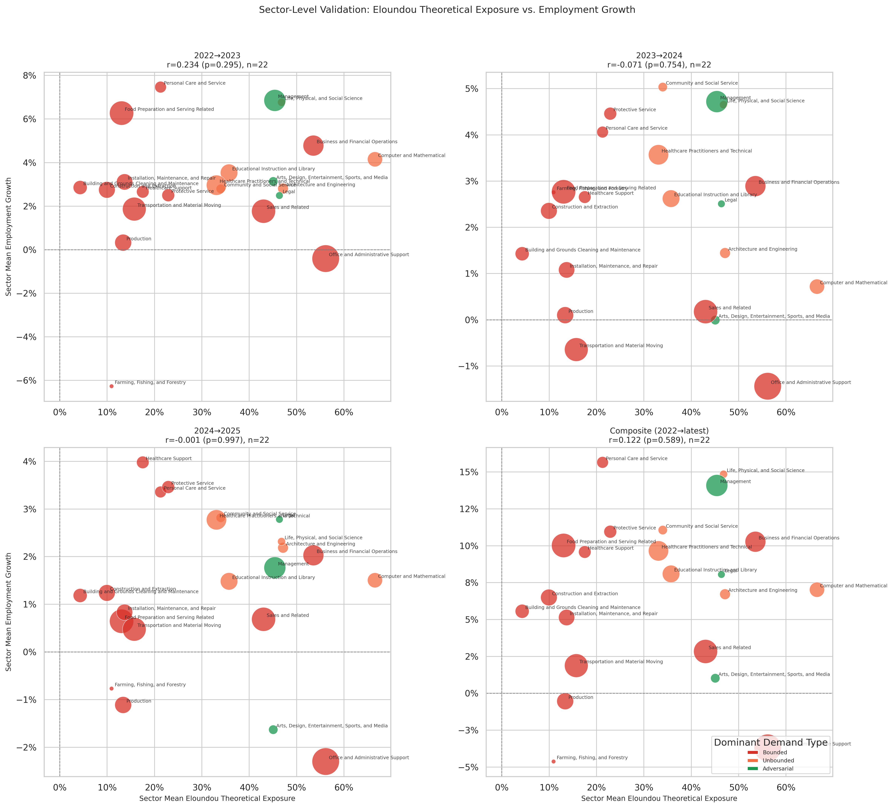

# Eloundou Theoretical Exposure: Sector-Level Employment Validation

**File:** `eloundou_sector_level_employment_validation.png`

## What this chart shows

Each bubble is one BLS major occupational group. The x-axis is the sector's employment-weighted mean Eloundou theoretical exposure score (`eloundou_exposure_mid`) — an estimate of the fraction of the sector's tasks that *could* be performed or accelerated by an LLM, based on human and model judgments from Eloundou et al. (2024). The y-axis is the sector's mean BLS employment growth for the given period. Bubble size scales with total sector employment.

This is the sector-level employment analog of the `theoretical_vs_rebound_adjusted_exposure.png` occupation-level scatter.

## Correlation by period

| Period | r | p |
|--------|---|---|
| 2022→2023 | +0.234 | 0.295 |
| 2023→2024 | +0.071 | 0.754 |
| 2024→2025 | −0.001 | 0.997 |
| Composite | +0.122 | 0.589 |

## Key observations

**No significant employment signal across any period.** The theoretical exposure model — which estimates AI task capability without conditioning on whether AI is actually being used — does not predict sector-level employment growth in any year. The correlations are small, inconsistent in sign, and all well below significance.

**The composite is essentially zero.** The 2022→23 positive and later near-zero results average to r = +0.122, obscuring the year-to-year variation but confirming no meaningful aggregate signal.

**The x-axis structure is distinctive from the other models.** Eloundou scores are compressed in the 30–65% range — most sectors cluster in the middle of the x-axis with no clear left tail. This is because the theoretical exposure measure doesn't distinguish between Bounded and Unbounded demand types: a healthcare task and a clerical task receive similar LLM-capability scores if both are "doable by an LLM," regardless of whether actual demand will rise or fall. The result is that sectors spread horizontally but don't separate strongly on the x-axis.

## Comparison to other models

| Model | Emp composite r | Emp 2023→24 r |
|-------|----------------|---------------|
| Eloundou theoretical | +0.122 | +0.071 |
| Anthropic observed | +0.191 | +0.364 |
| Rebound-adjusted | −0.247 | −0.412 |
| Dynamic equilibrium | +0.528 ** | +0.544 ** |

The Eloundou model has the weakest employment signal of the four. See `eloundou_sector_level_wage_validation.md` for the one period where it shows a strong signal.
