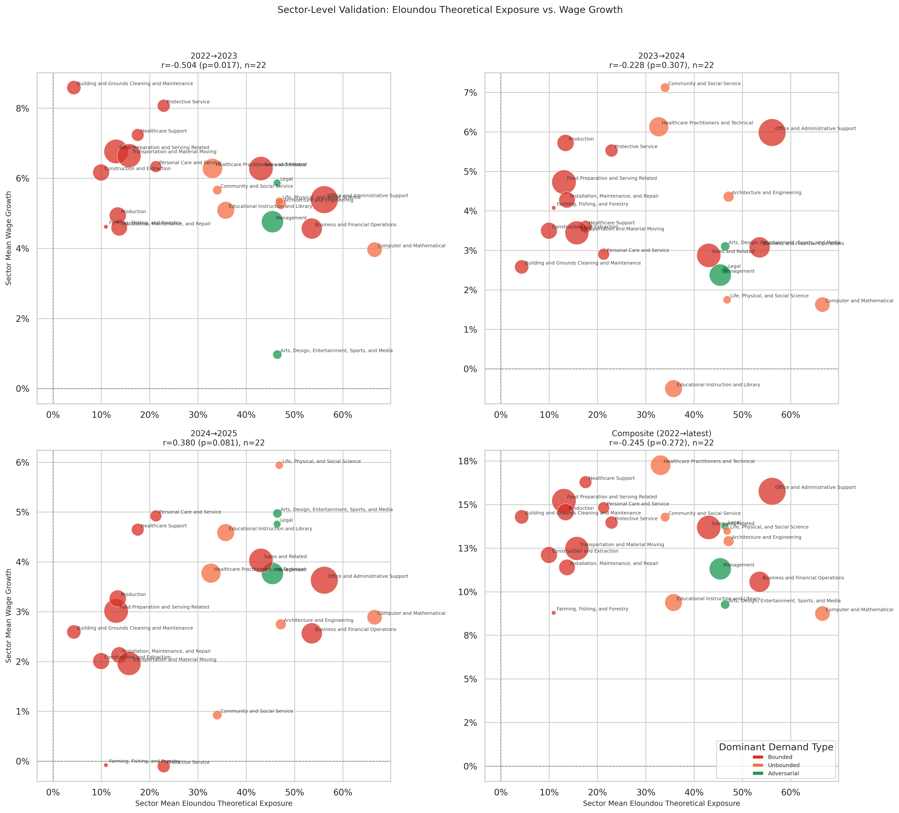

# Eloundou Theoretical Exposure: Sector-Level Wage Validation

**File:** `eloundou_sector_level_wage_validation.png`

## What this chart shows

Same layout as `eloundou_sector_level_employment_validation.png` but with sector mean wage growth on the y-axis. Four panels: 2022→23, 2023→24, 2024→25, composite.

## Correlation by period

| Period | r | p |
|--------|---|---|
| 2022→2023 | −0.504 | **0.017** |
| 2023→2024 | +0.228 | 0.307 |
| 2024→2025 | +0.380 | 0.081 |
| Composite | +0.245 | 0.272 |

## The 2022→23 negative correlation is a post-COVID confound, not an AI signal

**r = −0.504, p = 0.017** in 2022→23 appears significant, but the correlation is explained by post-COVID wage recovery dynamics rather than AI-driven wage suppression.

The sectors with the highest wage growth in 2022→23 are almost entirely physical and care occupations with the lowest Eloundou scores:

| Sector | Eloundou | Wage 22→23 |
|--------|----------|-----------|
| Building and Grounds Cleaning | 4.2% | +8.6% |
| Healthcare Support | 17.8% | +7.3% |
| Food Preparation and Serving | 13.1% | +6.8% |
| Transportation and Material Moving | 15.7% | +6.6% |
| Personal Care and Service | 21.0% | +6.3% |
| Construction and Extraction | 9.7% | +6.2% |

These sectors experienced severe labor shortages during the COVID pandemic and posted catch-up wage growth in 2022→23 that had nothing to do with AI. Because they are also the sectors with the lowest theoretical AI exposure (physical, site-dependent tasks score low on LLM capability), their wage recovery mechanically produces a negative correlation between Eloundou exposure and wage growth.

**When these 6 post-COVID recovery sectors are excluded, the correlation drops from r = −0.504 (p = 0.016) to r = −0.287 (p = 0.282)** — losing all statistical significance. The negative signal entirely disappears once the COVID confound is removed.

## Implication

There is no detectable AI-driven wage signal in 2022→23. The apparent finding is an artifact of the cross-sectional structure of Eloundou scores: low-exposure sectors happen to be physical and care occupations that were wage-suppressed during COVID and recovered first. The same structure explains why the Anthropic observed model (`anthropic_observed_sector_level_wage_validation.md`) shows an almost identical pattern — both measures assign low scores to physical sectors.

The sign flip to positive in 2024→25 (r = +0.380) may reflect a genuine productivity-wage effect in AI-exposed sectors, but with n = 22 it remains inconclusive.
