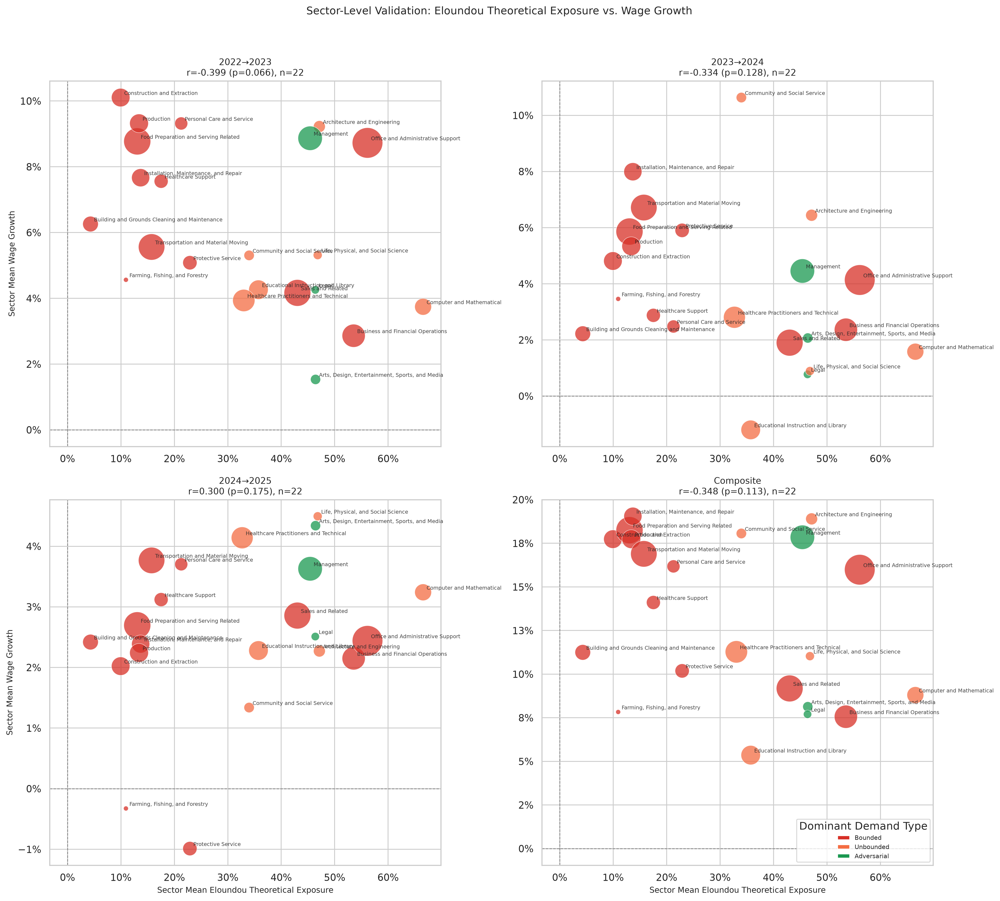

# Eloundou Theoretical Exposure: Sector-Level Wage Validation

**File:** `eloundou_sector_level_wage_validation.png`

## What this chart shows

Same layout as `eloundou_sector_level_employment_validation.png` but with the growth of each major group's median wage (from `bls_sector_trends.csv`) on the y-axis. Four panels: 2022→23, 2023→24, 2024→25, composite.

## Correlation by period

| Period | r | p |
|--------|---|---|
| 2022→2023 | −0.394 | 0.070 |
| 2023→2024 | −0.333 | 0.130 |
| 2024→2025 | +0.298 | 0.179 |
| Composite | −0.345 | 0.116 |

## The 2022→23 negative correlation is mostly a post-COVID confound

**r = −0.394, p = 0.070** in 2022→23 is not significant on the major-group series, and most of what is there is post-COVID wage recovery rather than AI-driven wage suppression. (On the earlier survivor-occupation series this period read r = −0.504, p = 0.017; the totals series is the better measure.)

The sectors with the highest median-wage growth in 2022→23 are largely physical and care occupations with low Eloundou scores:

| Sector | Eloundou | Wage 22→23 |
|--------|----------|-----------|
| Construction and Extraction | 9.9% | +10.1% |
| Production | 13.4% | +9.3% |
| Personal Care and Service | 21.3% | +9.3% |
| Food Preparation and Serving | 13.0% | +8.8% |
| Installation, Maintenance, and Repair | 13.7% | +7.7% |
| Healthcare Support | 17.5% | +7.6% |

These sectors experienced severe labor shortages during the COVID pandemic and posted catch-up wage growth in 2022→23 that had nothing to do with AI. Because they are also the sectors with the lowest theoretical AI exposure (physical, site-dependent tasks score low on LLM capability), their wage recovery mechanically produces a negative correlation between Eloundou exposure and wage growth.

**When the six physical and care recovery sectors are excluded, the correlation drops from r = −0.394 to r = −0.210 (p = 0.435).** Most of the 2022→23 relationship is the confound.

## Implication

There is no detectable AI-driven wage signal from theoretical exposure in 2022→23, and the composite is not significant either (r = −0.345, p = 0.116). The Anthropic observed model (`anthropic_observed_sector_level_wage_validation.md`) shares the low-score-for-physical-sectors structure, but its wage correlation is stronger, survives the same exclusion better, and is composite-significant, so the two should no longer be read as the same result.

The sign flip to positive in 2024→25 (r = +0.298) may reflect a productivity-wage effect in AI-exposed sectors, but with n = 22 it remains inconclusive.
