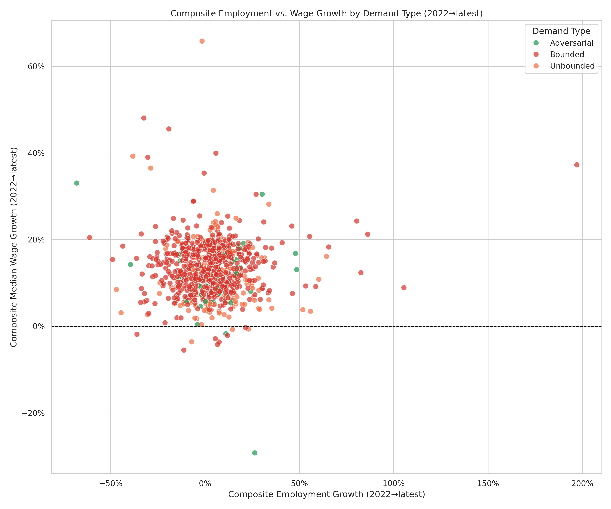

# Composite Employment vs. Wage Growth by Demand Type

**File:** `employment_vs_wage_growth_by_demand_type.png`

## What this chart shows

Each dot is one occupation, plotted by its composite employment growth (x-axis) against its composite wage growth (y-axis), both measured from 2022 to the latest available BLS data. Dots are colored by dominant demand type.

The chart tests two theoretical predictions about how different types of AI-exposed work should behave in the labor market:

**Bounded (red):** AI completes tasks to a fixed endpoint — demand falls once the backlog clears. The model predicts employment contraction. In the chart, Bounded occupations should cluster toward the left.

**Unbounded (orange):** AI reduces the cost of a task, freeing time that gets reinvested in doing more of the same work or adjacent work. Both employment and wages may grow. The model predicts a "productivity premium" — wages rising because workers who stay are more valuable per hour. Look for orange dots in the upper-right quadrant.

**Adversarial (green):** Work defined by a counterparty that escalates in response to any gain (fraud detection, cybersecurity, compliance). AI capability on both sides raises the stakes and volume of work. Both employment and wages should grow. Look for green dots in the upper-right quadrant.

## What the dispersed pattern means

The dots show no clear separation by demand type — Bounded, Unbounded, and Adversarial occupations overlap throughout the chart. There are several honest interpretations:

**AI-driven effects may not have materialized yet.** Widespread workforce restructuring takes time. Employers in Bounded occupations may be absorbing AI productivity gains without reducing headcount — at least through 2025. The predicted divergence between demand types may be a future signal, not a present one.

**Observed AI usage has been concentrated outside Bounded work.** The `usage_by_demand_type.png` chart shows Claude conversation volume is heavily skewed toward Unbounded occupations. If Bounded workers aren't yet adopting AI at scale, there's no mechanism yet for the displacement prediction to show up in employment data.

**The model or classifications may be wrong.** The demand type assignment relies on classifying each O\*NET task statement as Bounded, Unbounded, or Adversarial. If those labels are systematically off — particularly for large occupations that drive aggregate patterns — the model's predictions could be structurally incorrect rather than just early.

The sector-adjusted charts (`sector_adjusted_employment_growth.png`, `sector_adjusted_wage_growth.png`) strip out macroeconomic and sector-cycle noise, but the occupation-level signal remains absent in those views as well. The sector-level validation (`sector_level_validation.png`) also finds no statistically significant correlation — no view of the data currently shows a detectable AI effect in BLS outcomes through 2025.
