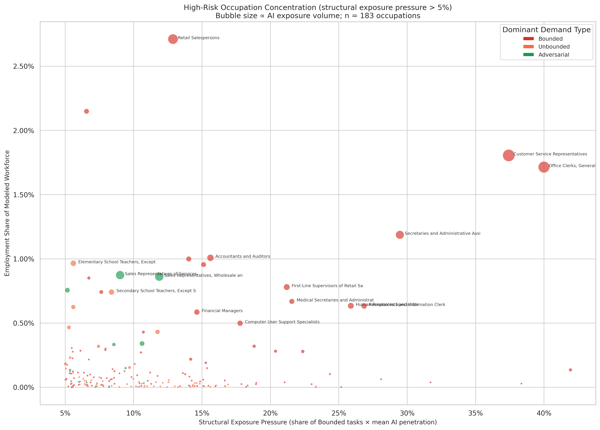

# High-Risk Occupation Concentration

**File:** `high_exposure_concentration.png`



## What this chart shows

Each bubble is one occupation that clears a minimum threshold of **structural exposure pressure** (above 5%). The axes reveal two dimensions of risk:

- **X-axis (structural exposure pressure):** How hard is this occupation being pushed toward displacement? Computed as the share of the occupation's tasks that are Bounded × the mean AI penetration across those tasks. An occupation with many Bounded tasks that are already seeing active AI use scores high here.
- **Y-axis (employment share):** How large is this occupation in the overall workforce? Higher means more workers are exposed.
- **Bubble size:** AI exposure volume — employment share × mean AI penetration. Larger bubbles represent occupations where AI is both prevalent and affecting a lot of workers.

## How structural exposure pressure is computed

```
displacement_pressure = pct_bounded × mean_penetration
```

`pct_bounded` is the share of the occupation's importance-weighted tasks that were classified as Bounded demand. `mean_penetration` is the average penetration score (from Anthropic's task penetration dataset) across the occupation's tasks — a measure of how actively Claude conversations are currently covering those tasks.

An occupation in the upper-right of the chart has high structural exposure pressure *and* a large workforce — the combination that represents the most concentrated structural risk.

## Notable occupations

**Customer Service Representatives** and **Office Clerks, General** appear in the far upper-right: large workforces (each ~1.7–1.8% of the modeled workforce), very high structural exposure pressure (38–41%), and the largest exposure volumes in the dataset.

**Retail Salespersons** appears high on the y-axis but at lower structural exposure pressure (~13%): it's a very large occupation, but a smaller fraction of its tasks are both Bounded and heavily AI-penetrated.

**Secretaries and Administrative Assistants** sits in the middle-right: smaller than the top two but still significant workforce share with ~29% structural exposure pressure.
