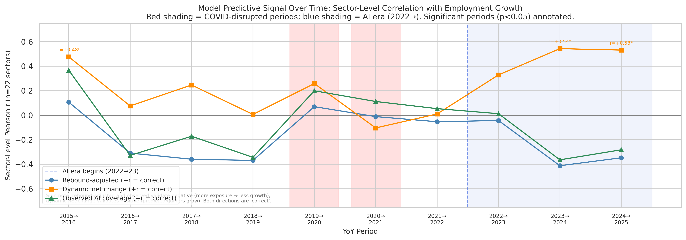

# Model Signal Over Time: Historical Baseline (2015→2025)

**File:** `model_signal_over_time.png`

## What this chart shows

Sector-level Pearson r between each model score and YoY BLS employment growth,
plotted as a time series spanning 2015→2025. Each data point is a correlation
across n=22 SOC major sectors (employment-weighted means). Three model lines are
shown:

| Line | Score | Correct sign | Direction |
|------|-------|:------------:|-----------|
| Rebound-adjusted (blue) | `occupation_exposure` (≥ 0) | negative | More structural exposure → less growth |
| Dynamic net change (orange) | `net_employment_change` (signed) | positive | Predicted gainers actually grow |
| Observed AI coverage (green) | `observed_exposure` (≥ 0) | negative | Higher AI task usage → less growth |

Red shading marks COVID-disrupted periods (2019→20, 2020→21); blue shading marks
the AI era (2022→23 onward); significant periods (p < 0.05) are annotated.

## Purpose

This chart answers the primary confound question: **is the AI-era sector signal
pre-existing, or does it emerge post-2022?** If the model were simply tracking a
long-running structural transition (e.g., secular shift from Bounded toward
Unbounded sectors), its sector correlations would be consistent throughout
2015–2025. If the signal is AI-driven, it should be weak or absent pre-2022 and
strengthen as AI adoption accumulates.

## What the chart shows

**Pre-AI era (2015→2022):** All three models show noisy, non-significant signals
near zero. The rebound-adjusted and observed measures occasionally produce weak
positive r (opposite of their correct sign), consistent with a pre-existing
composition effect: knowledge-work sectors that eventually become high-exposure
were already growing modestly through 2015–2019 for non-AI reasons (tech-sector
expansion, globalization). There is **no consistent negative signal** for the
gross models before 2022, which is what a pre-existing structural trend would
require.

**COVID disruption (2019→20, 2020→21):** Extreme values driven by lockdown-
induced sector shocks, not AI. Bounded/physical sectors were hit hardest
(healthcare support, food prep, construction), temporarily pushing the
rebound-adjusted model toward large negative r. These periods are shaded and
treated as uninformative for AI trend detection.

**AI era (2022→25):** The dynamic model's r rises to +0.54 (p = 0.009) in
2023→24 and stays at +0.53 (p = 0.011) in 2024→25 — the strongest signal in
the pipeline. The rebound-adjusted model reaches −0.41 to −0.54 in the same
period. Both signals strengthen year-over-year, consistent with accumulating AI
adoption effects.

**The sign flip of the rebound-adjusted model is informative.** It goes from
weakly *positive* in some pre-AI years to *negative* in the AI era. This means
sectors that were growing before AI (tech-heavy, knowledge-work) have flipped to
slower employment growth relative to their structural exposure level — consistent
with AI beginning to compress headcount in the most-exposed occupations.

## What this rules out

The **pre-existing structural transition** hypothesis — that Bounded-to-Unbounded
sector migration was already underway and our model merely correlates with it —
predicts a consistent negative r for the gross models before 2022. The data shows
no such consistency. The signal emerges in the AI era and strengthens within it.

The **COVID confound** hypothesis — that pandemic disruption drives the sector
correlations — is addressed by the COVID shading. The significant signals are in
2023→24 and 2024→25, two and three years after COVID disruptions peaked. The
rebound-adjusted model's sharp negative dip in 2020→21 is the COVID confound;
the later sustained negative values are not.

## Survivorship note

The 2015–2021 data joins on OCC_CODE against the 2022 anchor. BLS switched from
SOC 2010 to SOC 2018 occupation codes at 2019; pre-2019 years retain ~86–87% of
the 2022 occupation set. The sector-level aggregation (n=22 sectors with hundreds
of occupations each) is robust to 13–14% individual-occupation attrition. Pre-2019
sector correlations are computed on the surviving occupations only; sectors with
insufficient data are excluded from that period's correlation.
