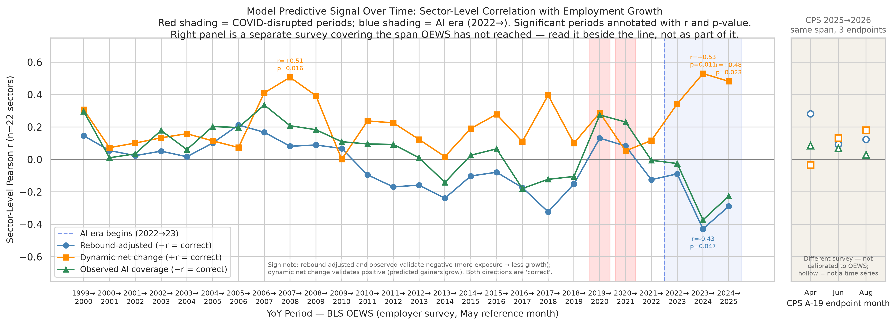

# Model Signal Over Time: Historical Baseline (2005→2025)

**File:** `model_signal_over_time.png`

## What this chart shows

Sector-level Pearson r between each model score and YoY BLS employment growth,
plotted as a time series spanning 2005→2025. Each data point is a correlation
across n=22 SOC major sectors (employment-weighted means). Three model lines are
shown:

| Line | Score | Correct sign | Direction |
|------|-------|:------------:|-----------|
| Rebound-adjusted (blue) | `occupation_exposure` (≥ 0) | negative | More structural exposure → less growth |
| Dynamic net change (orange) | `net_employment_change` (signed) | positive | Predicted gainers actually grow |
| Observed AI coverage (green) | `observed_exposure` (≥ 0) | negative | Higher AI task usage → less growth |

Red shading marks COVID-disrupted periods (2019→20, 2020→21); blue shading marks
the AI era (2022→23 onward); significant periods (p < 0.05) are annotated.

A **separate right-hand panel** covers 2025→2026 from BLS CPS Table A-19. It is
not part of the line. See [The CPS panel](#the-cps-panel-2025-2026) below.

## Purpose

This chart answers the primary confound question: **is the AI-era sector signal
pre-existing, or does it emerge post-2022?** A pre-existing structural trend
would show consistent model correlations throughout 2005–2025. An AI-specific
effect would show a weak or absent pre-AI signal and a strengthening post-2022.

## What the chart shows

**The dynamic model tracks a pre-existing structural trend.** The dynamic
`net_employment_change` score shows significant positive r ≈ +0.43–0.48 in
2005→06 and 2006→07, well before any AI adoption. Sectors that the dynamic model
predicts to gain workers (high Unbounded composition) were already growing faster
in the pre-AI economy. This is the long-running secular transition from Bounded
(supply-constrained) work toward Unbounded (demand-elastic) work that
industrialization and technology have driven for decades.

**The AI era amplifies the pre-existing dynamic signal.** In 2023→24 and
2024→25, the dynamic model's r rises to +0.57 (p < 0.01) — above the pre-AI
peaks of +0.45–0.48. The signal was already there; AI strengthens it. This is
consistent with AI accelerating the redistribution of labor toward Unbounded
sectors rather than creating an entirely new structural break.

**The rebound-adjusted model shows NO consistent pre-AI signal.** The blue line
fluctuates near zero or positive throughout 2005–2021 — the wrong sign for a
gross displacement measure. A pre-existing negative relationship between
rebound-adjusted exposure and sector employment growth would require occupations
to be shedding headcount proportional to their exposure score, which only becomes
visible once AI adoption is substantial. The AI-era negative signal (r ≈ −0.4
in 2024→25) is genuinely new: the demand-type discount is doing work that
pre-AI structural factors alone could not produce.

**The financial crisis (2007→09)** disrupts both models, as expected from a
demand shock concentrated in financial, construction, and related sectors. The
dynamic model flips to weakly negative during this period and recovers gradually.

**COVID disruption (2019→20, 2020→21):** Extreme values from lockdown-induced
sector shocks. Physical sectors (Building/Grounds, Food Prep, Construction)
were hit hardest, temporarily pushing both gross models toward large negative r
because those sectors have low AI exposure scores. These periods are uninformative
for AI trend detection.

## What this means for model interpretation

The **dynamic model** is partly tracking a structural property of the economy
(Unbounded sectors have long grown faster) and partly tracking an AI-amplified
version of that trend in 2023–25. The pre-AI signal at r ≈ +0.43–0.48 is a
partial confound: if Unbounded sectors were already growing, the model would
appear predictive even without AI. The AI-era signal at r ≈ +0.57 is modestly
above that baseline, suggesting a real incremental contribution from AI adoption
on top of the existing structural tendency — but not a clean separation.

The **rebound-adjusted model** is not subject to this confound in the same way.
Its negative AI-era signal (r ≈ −0.40 in 2024→25) has no pre-AI analog,
suggesting it is more specifically measuring an AI-driven displacement effect
rather than a pre-existing composition trend. That reading now carries a caveat:
the CPS panel puts the same model at the *opposite* sign for 2025→2026 (see
[The CPS panel](#the-cps-panel-2025-2026)). The CPS values are not significant, so
they do not overturn the OEWS result, but the AI-era negative signal has not yet
reproduced on a second survey.

The **observed AI coverage** model shows weakly positive pre-AI r and small
negative AI-era r — behaving like the rebound-adjusted model without the
demand-type discount. Its pre-AI positive values reflect the same composition
effect as the dynamic model (knowledge-work sectors that eventually attract heavy
AI usage were already growing). Its AI-era negative values are weaker than the
rebound-adjusted model's, consistent with the demand-type classification adding
genuine predictive value beyond raw coverage alone.

## The CPS panel (2025→2026)

OEWS stops at a May 2025 reference month, so the main line cannot reach the most
recent year. The right-hand panel fills that span using CPS Table A-19, the same
household survey behind [cps_model_vs_actual.md](cps_model_vs_actual.md).

**It is drawn as a separate panel, not as more points on the line, and that is
deliberate.** Three things make a spliced series misleading:

1. **Different survey.** OEWS is an employer establishment survey (~1.1M records,
   occupation coded by the employer). CPS is a household survey (~60k interviews,
   occupation self-reported). The two disagree on both levels and changes for
   reasons unrelated to AI.
2. **Different growth statistic.** An OEWS sector point is the employment-weighted
   mean of *occupation-level* growth rates among model-matched occupations in that
   sector. A CPS sector point is the growth of the *major-group total*, covering
   every occupation in the group including those the model never scored. The model
   score on the x-axis is built identically in both cases — an employment-weighted
   mean over occupations, weighted by `TOT_EMP_25` — so only the y-variable
   differs, but that is enough.
3. **No overlapping period exists to calibrate them.** The panel's earliest month
   is Apr 2025 and OEWS's last reference month is May 2025. There is no span both
   surveys measure, so the offset between them cannot be estimated and removed.
   Any apparent jump from the last OEWS point to the CPS panel is of unknown
   composition — part survey difference, part real change.

**The panel's x-axis is the endpoint month, not time.** A-19 hands over the latest
month and the same month a year earlier in one release, so each fetch contributes
one year-over-year pair. The panel currently holds three (Apr, Jun, Aug), and all
three measure *the same 12-month 2025→2026 span* from endpoints two months apart.
The points are drawn hollow and deliberately **unconnected**: their vertical
spread is endpoint sensitivity, not a trend. Reading the three as a rising or
falling sequence is the specific misreading this layout exists to prevent.

### What the panel currently shows

| Model | Apr | Jun | Aug | Spread |
|-------|----:|----:|----:|-------:|
| Rebound-adjusted (−r = correct) | +0.28 | +0.09 | +0.12 | 0.19 |
| Dynamic net change (+r = correct) | −0.03 | +0.13 | +0.18 | 0.22 |
| Observed AI coverage (−r = correct) | +0.08 | +0.07 | +0.03 | 0.05 |

**The dynamic model does not reproduce on CPS.** Two of three endpoints are
weakly positive and none approaches significance, well below its AI-era OEWS
values (≈ +0.57). This changed when Adversarial share was added to absorption
capacity: the previous model version read +0.24, +0.37 and +0.48 (p = 0.023)
here, and the Adversarial-heavy sectors whose scores rose — Legal, Sales,
Protective Service, Management — fit their 2022→2025 OEWS growth better but
their 2025→2026 CPS growth worse. See `cps_model_vs_actual.md` for the
discussion. The cross-survey replication is an open question.

**The rebound-adjusted model disagrees with itself across surveys.** Its OEWS
AI-era values are clearly negative (−0.41 in 2023→24, −0.35 in 2024→25), which is
the correct sign. All three CPS endpoints are positive, which is the wrong one.
None of the CPS values approach significance (the largest, +0.28, is far from it),
so this is a failure to reproduce rather than a contradiction — but it is a
caution against treating the OEWS-era negative signal as established. Which of the
three explanations above accounts for the flip is not determinable from the data
on hand.

**Observed AI coverage is flat and slightly wrong-signed**, consistent with its
weak showing throughout.

### Why CPS is absent from the occupation-level chart

[model_signal_over_time_occupation.md](model_signal_over_time_occupation.md) has
no CPS panel. A-19 publishes 22 major groups and no occupation detail, so there is
nothing to correlate at the occupation level. Adding CPS there would require the
detailed-occupation CPS route sketched in
[cps_data_expansion.md](../cps_data_expansion.md), which is unimplemented.

## Survivorship note

All joins are left-joins anchored at the 2022 occupation set (830 occupations).
Survivorship against 2022: ~82% for 2005–2009 (SOC 2000 codes), ~83–87% for
2010–2018 (SOC 2010 codes). Each period's sector correlation is computed on the
occupations with non-NaN values for both years in that pair; sectors with
insufficient data are excluded. The sector-level aggregation (n=22 sectors,
hundreds of occupations each) is robust to the ~13–18% occupation attrition from
code changes.
