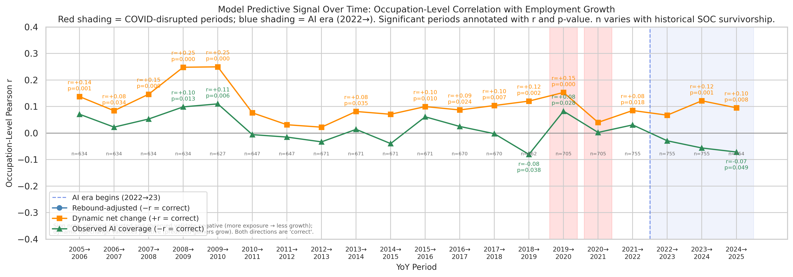

# Model Signal Over Time: Occupation-Level Baseline (2005→2025)

**File:** `model_signal_over_time_occupation.png`

## What this chart shows

Occupation-level Pearson r between each model score and YoY BLS employment growth,
plotted as a time series spanning 2005→2025. Unlike the sector-level version
(`model_signal_over_time.png`), no aggregation step is applied — each occupation
is one data point. n varies by period due to historical SOC code survivorship
and is annotated along the bottom of the chart.

| Line | Score | Correct sign | Direction |
|------|-------|:------------:|-----------|
| Rebound-adjusted (blue) | `occupation_exposure` (≥ 0) | negative | More structural exposure → less growth |
| Dynamic net change (orange) | `net_employment_change` (signed) | positive | Predicted gainers actually grow |
| Observed AI coverage (green) | `observed_exposure` (≥ 0) | negative | Higher AI task usage → less growth |

Red shading marks COVID-disrupted periods (2019→20, 2020→21); blue shading marks
the AI era (2022→23 onward); significant periods (p < 0.05) are annotated with r, p, and n.

## Relationship to the sector-level chart

The sector-level chart (`model_signal_over_time.png`) aggregates occupations to 22
SOC major groups first and correlates those 22 group means. That version has low
power (n=22) but suppresses within-group noise by averaging. This chart operates on
raw occupations (n ≈ 400–830 depending on the period), giving much higher statistical
power — a much smaller |r| is detectable — but also more noise from individual
occupation volatility.

The two charts are complementary:
- Occupation-level: higher power, noisier, picks up fine-grained structural variation
- Sector-level: lower power, cleaner signal, more interpretable for policy discussion

## What the chart shows

**The dynamic model's occupation-level signal is less clean than at sector level.**
Individual occupation employment growth is driven by many idiosyncratic factors
(firm-specific hiring, licensing changes, local demand shocks) that cancel at the
sector level but add noise at the occupation level. The pre-AI positive r for the
dynamic model (visible in 2005–2009 at sector level) is weaker and less consistent
here, as the sector-composition effect dilutes across hundreds of individually noisy
occupations.

**The rebound-adjusted model shows a consistent negative r in the AI era** (2022→25),
broadly consistent with the sector-level finding. The occupation-level r values are
smaller in magnitude than sector-level because noise dominates within-sector
variation, but the negative direction is persistent.

**COVID disruption (2019→20, 2020→21):** Same pattern as sector level — lockdown
concentration in low-exposure physical occupations temporarily pushes gross models
toward negative r regardless of mechanism.

## Survivorship note

Historical BLS files use different SOC code generations (SOC 2000 for 2005–2009,
SOC 2010 for 2010–2018). The occupation set is anchored at 2022 (SOC 2018 codes)
and all earlier years are left-joined. Occupations whose codes changed across
generations produce NaN for those historical columns and are excluded from those
periods' correlations. Survivorship is ~82% for 2005–2009, ~83–87% for 2010–2018;
the per-period n is shown at the bottom of the chart.
