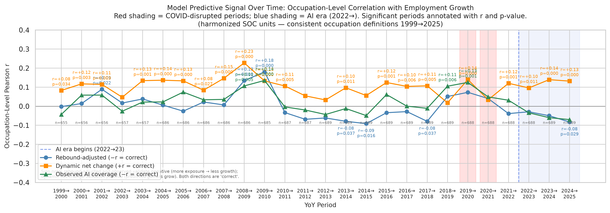

# Model Signal Over Time: Occupation-Level Baseline (2005→2025)

**File:** `model_signal_over_time_occupation.png`

## What this chart shows

Occupation-level Pearson r between each model score and YoY BLS employment growth,
plotted as a time series spanning 2005→2025. Unlike the sector-level version
(`model_signal_over_time.png`), no sector aggregation step is applied — each
harmonized SOC unit is one data point. n is annotated along the bottom of the
chart and is now close to constant across periods (see *Harmonized units* below).

| Line | Score | Correct sign | Direction |
|------|-------|:------------:|-----------|
| Rebound-adjusted (blue) | `occupation_exposure` (≥ 0) | negative | More structural exposure → less growth |
| Dynamic net change (orange) | `net_employment_change` (signed) | positive | Predicted gainers actually grow |
| Observed AI coverage (green) | `observed_exposure` (≥ 0) | negative | Higher AI task usage → less growth |

Red shading marks COVID-disrupted periods (2019→20, 2020→21); blue shading marks
the AI era (2022→23 onward); significant periods (p < 0.05) are annotated with r, p, and n.

## Relationship to the sector-level chart

The sector-level chart (`model_signal_over_time.png`) aggregates occupations to 22
SOC major groups first and correlates those 22 group means. That version has low
power (n=22) but suppresses within-group noise by averaging. This chart operates on
harmonized occupation units (n ≈ 695 in every period), giving much higher statistical
power — a much smaller |r| is detectable — but also more noise from individual
occupation volatility.

The two charts are complementary:
- Occupation-level: higher power, noisier, picks up fine-grained structural variation
- Sector-level: lower power, cleaner signal, more interpretable for policy discussion

## What the chart shows

**The dynamic model's occupation-level signal is positive throughout the whole
2005→2025 span.** The orange line stays above zero in all 20 periods and is
significant in most of them, both before and after 2022 — peaking at r=+0.23
(p<0.001) in 2008→09 and holding at r=+0.09 to +0.14 (p<0.05) across all three
AI-era periods. Individual occupation employment growth is still driven by many
idiosyncratic factors (firm-specific hiring, licensing changes, local demand
shocks) that cancel at the sector level but add noise at the occupation level,
so the occupation-level r values run smaller in magnitude than the sector-level
ones. But on harmonized units that noise no longer erases the pre-AI pattern:
the same pre-2010 tendency for Unbounded/Adversarial-heavy occupations to grow
faster that the sector-level chart shows also shows up here.

**The rebound-adjusted model shows a consistent negative r in the AI era** (2022→25),
broadly consistent with the sector-level finding. The occupation-level r values are
smaller in magnitude than sector-level because noise dominates within-sector
variation, but the negative direction is persistent.

**COVID disruption (2019→20, 2020→21):** Same pattern as sector level — lockdown
concentration in low-exposure physical occupations temporarily pushes gross models
toward negative r regardless of mechanism.

## Harmonized units

Each point in a period's correlation is a **harmonized unit**, not a raw BLS
occupation code. A unit is a connected component of the published BLS SOC
crosswalks (SOC 2000 → SOC 2010 → SOC 2018) plus the OEWS hybrid structure,
built by `harmonize_soc.py` and written to
`data/output/soc_harmonization_units.csv`. Where a revision split one
occupation into three, or merged three into one, all of those codes land in the
same unit, so the unit means the same thing in 2005 as it does in 2025.

**Why this is necessary.** Anchoring on the 2022 code set and left-joining
earlier years keeps only the codes that happened to survive each revision —
about 82% for 2005–2009 and 83–87% for 2010–2018 overall, but very uneven by
sector. SOC 2018 renumbered every computer code, so Computer and Mathematical
kept four maths occupations, roughly 3% of its employment, before 2019. Pre-2019
points computed that way silently under-represented exactly the sectors the
models care most about. Correlating on units removes that selection: the same
occupation definitions carry the whole 2005→2025 span.

**What n is.** The unit file holds 762 unit ids, 751 of which have a 2022
member, and 706 of those have at least one 2022 member with a model score,
which is why n on the chart sits at 694–698 (the remainder is per-period NaN
growth). Before harmonization the pre-2019 n sat around 650–690 and dipped
unevenly by sector; it is now essentially flat, so movement in the lines is
signal rather than a changing sample. The trade-off is power: AI-era periods
previously used all 830 detailed 2022 codes and now use about 698 units, so
this chart has somewhat less power in 2022→2025 than before, in exchange for a
consistent series back to 2005.

A unit's score is the 2025-employment-weighted mean over its scored 2022
members, with weights renormalised over the members that actually have the
score; its growth comes from `data/output/bls_harmonized_trends.csv`, which sums
each unit's member employment per year before differencing.

**Where a unit is still NaN.** A unit's year is NaN — never 0 — when its
membership for that year is incomplete: a member code OEWS publishes was
suppressed or absent from that year's file. Summing the members that remain
would read as a collapse in employment rather than as the missing observation
it is. That is what keeps n a few units short of 706 rather than exactly equal.

**The one approximation is residual pruning.** Crosswalk edges that run between
a residual "All Other" catch-all and a named occupation are dropped before the
components are cut — left in, the catch-alls chain unrelated occupations
together until most of a major group fuses into a single unit. 62 edges are
pruned, and every one is listed in
`data/output/soc_harmonization_pruned_edges.csv` with its source and target
code and title, so the approximation is auditable rather than implicit.
