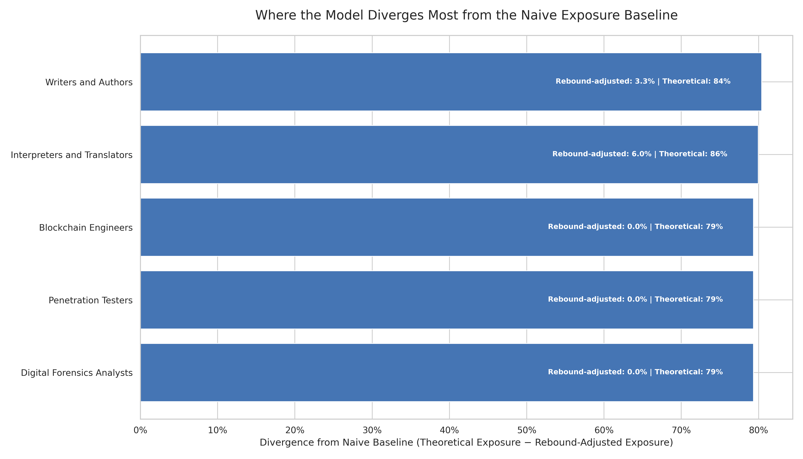

# Where the Model Diverges Most from the Naive Exposure Baseline

**File:** `model_vs_naive_divergence.png`



## What this chart shows

These are the five occupations where this model's prediction departs most from what you'd expect if AI exposure always caused displacement.

The bar length is the **divergence score**: how much lower our model's predicted displacement is compared to what the naive exposure baseline would predict. A large divergence means the occupation has high raw AI exposure according to prior literature, but our model's rebound analysis reduces that to a much smaller net impact.

Each bar is annotated with both the model's impact score and the raw exposure estimate, so you can see how large the departure is in absolute terms.

## How divergence is computed

```
divergence = eloundou_exposure_mid − occupation_impact
```

`eloundou_exposure_mid` is the Eloundou et al. estimate of how exposed the occupation's tasks are to LLMs. Their paper implicitly assumes exposure leads to displacement. `occupation_impact` is this model's net displacement prediction after applying demand-type rebound. A large divergence means the model is substantially more optimistic than the naive exposure baseline.

## Why these occupations show up here

All five are Unbounded or Adversarial demand types. For example:

- **Market Research Analysts:** High exposure (54%) according to Eloundou et al., but the demand for market insight is open-ended — AI time savings get reinvested in more analysis. Rebound absorbs most of the predicted displacement.
- **Computer Programmers:** Very high exposure (82%) in the literature, but programming demand has historically expanded with productivity tools. The Unbounded demand type reduces the net impact substantially.
- **Writers and Authors:** Exposure is high (84%) because writing is LLM-amenable, but content demand is elastic — the same rebound dynamic applies.

The chart is intentionally limited to five occupations to highlight the clearest signal; see `prior_exposure_vs_model_impact.png` for the full distribution.
