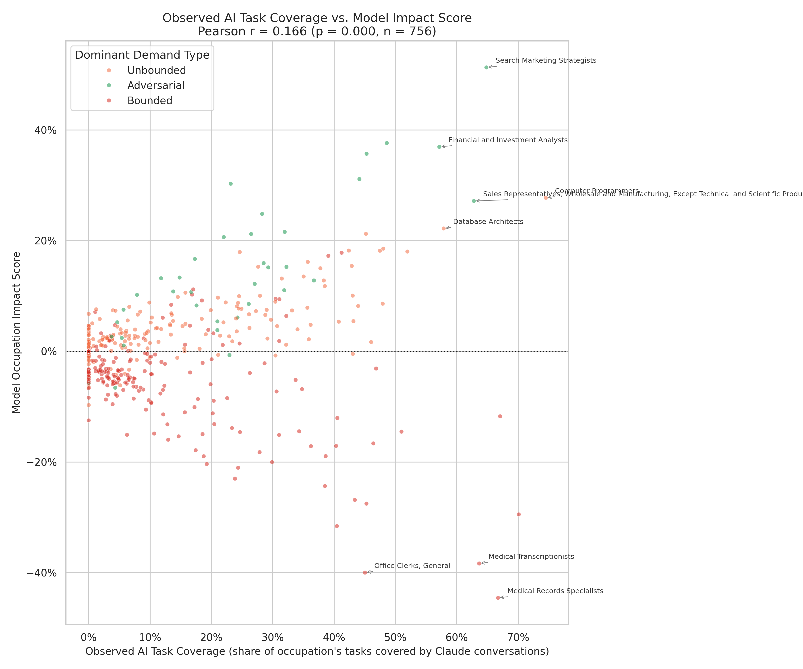

# Observed AI Task Coverage vs. Model Impact Score

**File:** `observed_ai_usage_vs_model_impact.png`

## What this chart shows

Each dot is one occupation. The x-axis shows how much of that occupation's task work is already covered by actual Claude conversations (measured by Anthropic from real usage data). The y-axis shows this model's predicted impact score for that occupation.

## What the x-axis data is

The x-axis comes from Anthropic's Economic Index dataset (`job_exposure.csv`). For each occupation, it reports the fraction of the occupation's O\*NET tasks that appear in Claude conversation logs — a measure of how much workers in that role are already using Claude to assist with their actual job tasks. This is empirical observation, not a forecast.

## What the weak correlation (r = 0.166) means

The Pearson r of 0.166 indicates that higher observed AI usage does not consistently predict higher (or lower) model impact. This is expected and informative:

High observed coverage can mean two very different things depending on demand type:

- **Adversarial / Unbounded occupations** (green/orange dots in the upper-right): Heavy AI use accelerates the work rather than replacing it. High coverage predicts expansion.
- **Bounded occupations** (red dots): High AI coverage means the displacement is already underway. High coverage predicts contraction.

These two effects roughly cancel in the aggregate correlation, producing the weak r. The chart makes this visible: the upper-right cluster (high coverage + positive impact) is mostly Adversarial/Unbounded, while high-coverage Bounded occupations (Medical Records Specialists, Office Clerks) fall toward the bottom-right.

## Labeled outliers

Annotated occupations were selected to show both sides of the split:
- **Upper-right:** High observed coverage + positive model impact (Search Marketing Strategists, Financial and Investment Analysts, Computer Programmers)
- **Lower-right:** High observed coverage + negative model impact (Medical Transcriptionists, Medical Records Specialists, Office Clerks, General)
