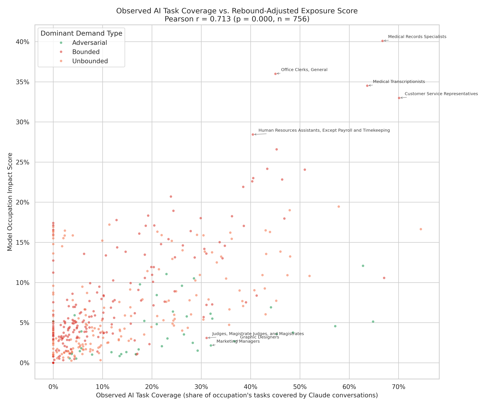

# Observed AI Task Coverage vs. Rebound-Adjusted Exposure Score

**File:** `observed_vs_rebound_adjusted_exposure.png`

## What this chart shows

Each dot is one occupation. The x-axis shows how much of that occupation's task work is already covered by actual Claude conversations (measured by Anthropic from real usage data). The y-axis shows this model's predicted impact score for that occupation.

## What the x-axis data is

The x-axis comes from Anthropic's Economic Index dataset (`job_exposure.csv`). For each occupation, it reports the fraction of the occupation's O\*NET tasks that appear in Claude conversation logs — a measure of how much workers in that role are already using Claude to assist with their actual job tasks. This is empirical observation, not a forecast.

## What the strong correlation (r = 0.712) means

The Pearson r of 0.712 indicates that higher observed AI usage is a strong predictor of higher model displacement impact. This is a direct consequence of the non-negative impact model:

- **Bounded occupations** (red dots): High AI coverage translates to high net displacement — no rebound absorbs the impact. These are the dominant driver of the strong positive correlation.
- **Adversarial / Unbounded occupations** (green/orange dots): High AI coverage produces near-zero impact because rebound absorbs most of the displacement. These dots cluster near the x-axis regardless of coverage.

In the previous signed model, Adversarial/Unbounded occupations sat in positive territory (high coverage + positive impact) while Bounded occupations sat in negative territory (high coverage + negative impact) — the two clusters pulled in opposite directions and roughly canceled, producing a weak r ≈ 0.17. With the non-negative model, both clusters sit at or above the x-axis, and the strong correlation reflects that Bounded-dominated occupations with high penetration dominate the upper-right of the scatter.

## Labeled outliers

Annotated occupations illustrate both ends of the scatter:
- **Upper-right:** High observed coverage + high displacement impact (Medical Records Specialists, Office Clerks, Customer Service Representatives — Bounded, no rebound)
- **Lower-right:** High observed coverage + low model impact (Search Marketing Strategists, Financial and Investment Analysts — Adversarial/Unbounded, rebound absorbs displacement)
