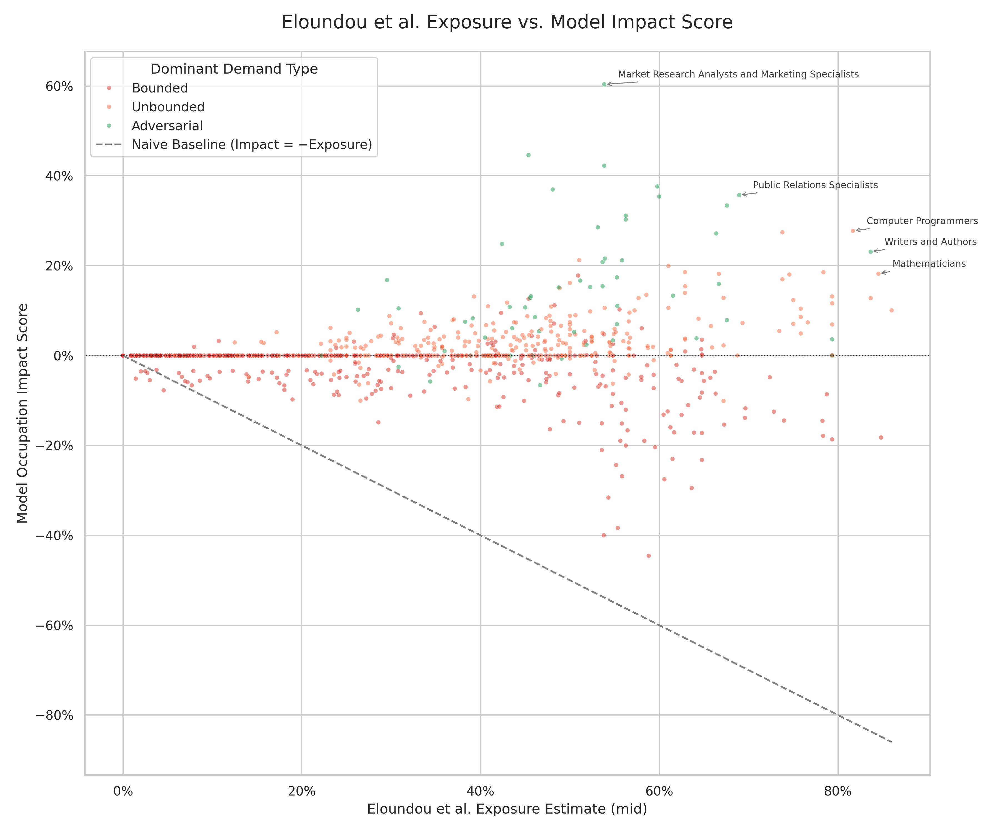

# Prior Exposure vs. Model Impact Score

**File:** `prior_exposure_vs_model_impact.png`

## What this chart shows

Each dot is one occupation. The x-axis plots how exposed that occupation's tasks are to AI according to a published estimate from prior literature (Eloundou et al.), and the y-axis shows the impact score this model predicts for that same occupation.

The y-axis is the model's net displacement impact score — always ≥ 0, where higher means greater structural disruption. Adversarial and Unbounded occupations cluster near zero (rebound absorbs displacement); Bounded occupations sit higher (little or no rebound).

The core finding of the model: raw exposure alone is a poor predictor of labor market impact, because the *type* of demand underlying those tasks changes how much of the AI-driven displacement actually persists after rebound.

## What the Eloundou et al. exposure estimate is

The x-axis values come from *GPTs are GPTs: An Early Look at the Labor Market Impact Potential of Large Language Models* (Eloundou, Manning, Mishkin, Rock, 2023). That paper scores each occupation by the fraction of its tasks that could be performed or assisted by an LLM, using a combination of human annotation and GPT-4 evaluation. The "mid" estimate averages their human and model scores.

That paper does not model demand type — it treats all exposure as equally risky. This chart shows where those exposure scores land relative to this model's more granular predictions.

## How to read the dot colors

Colors indicate each occupation's **dominant demand type** — the classification that carries the most task-importance weight for that occupation:

- **Red (Bounded):** Tasks where AI can complete the work to a fixed endpoint. No rebound — impact stays high.
- **Orange (Unbounded):** Tasks where capacity savings get reinvested into doing more. Partial rebound reduces impact.
- **Green (Adversarial):** Tasks driven by a counterparty that escalates in response (e.g., fraud, compliance, security). Full rebound — impact near zero.

## What "diverges from the naive baseline" means

High Eloundou exposure + low model impact = the model is more optimistic than prior literature would suggest. The labeled outliers (Market Research Analysts, Computer Programmers, etc.) all fall into Unbounded or Adversarial demand types — their rebound absorbs most of the predicted displacement, even though their raw AI task exposure is high.
