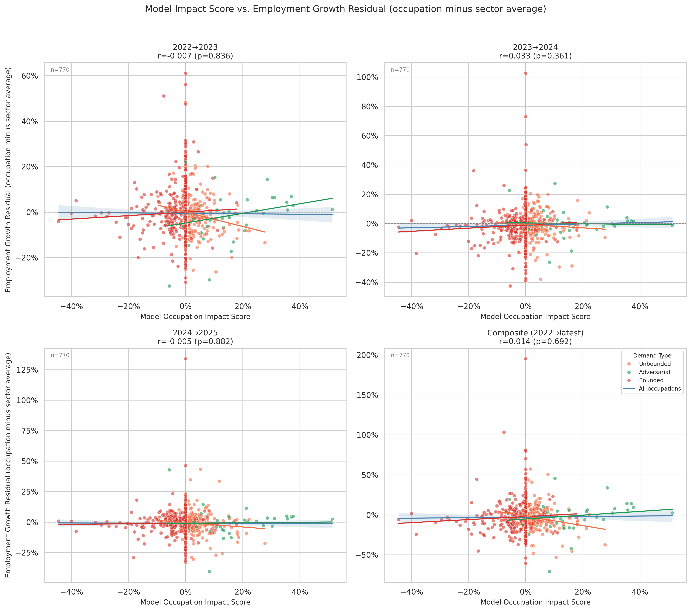
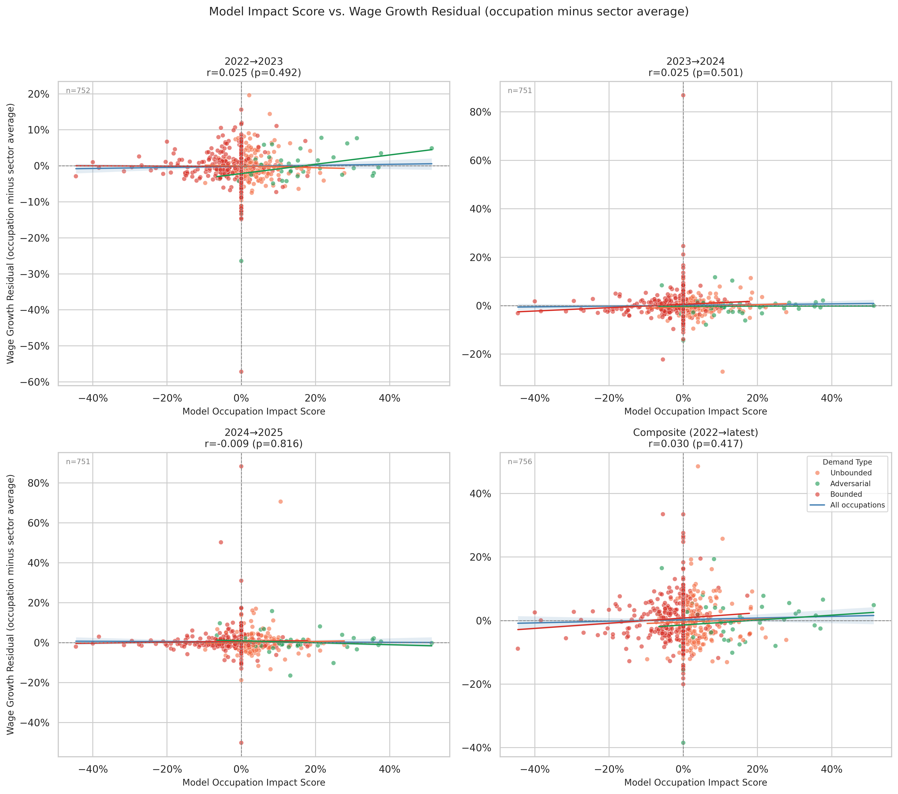

# Sector-Adjusted Employment and Wage Growth

**Files:** `sector_adjusted_employment_growth.png`, `sector_adjusted_wage_growth.png`





## What these charts show

These are the same layout as `model_vs_actual_employment_growth.png` and `model_vs_actual_wage_growth.png`, but the y-axis has been adjusted to remove sector-level trends before plotting.

## Why sector adjustment matters

Observed employment and wage growth are driven by three layered forces:

1. **National business cycle** — the whole economy growing or contracting
2. **Sector-level trends** — e.g., healthcare expanding post-pandemic regardless of AI
3. **Occupation-specific effects** — the signal this model is trying to predict

The raw validation charts test the model against (1 + 2 + 3) combined. The sector-adjusted charts strip out the sector component, leaving a residual that is a cleaner test of occupation-specific prediction.

## How the adjustment is computed

For each occupation, the sector mean growth is the employment-weighted average growth of all occupations in the same 2-digit SOC major group (e.g., "Healthcare Practitioners and Technical"). The residual plotted here is:

```
residual = occupation_growth − employment_weighted_sector_mean_growth
```

A positive residual means the occupation outperformed its sector peers; a negative residual means it underperformed. If the model's rebound-adjusted exposure score predicts anything real at the occupation level, it should predict these residuals better than it predicts raw growth.

## Interpreting the correlation statistics

Each subplot shows a Pearson r and p-value for the rebound-adjusted exposure score vs. the growth residual in that period. A small r (close to zero) with a high p-value means the model's occupation-specific prediction is not showing up in the BLS data.

There are several plausible explanations:

**AI adoption hasn't reached the scale needed to show up in aggregate employment data yet.** The BLS data runs through 2025, and widespread AI-driven workforce restructuring likely takes years to manifest in headcount changes. Employers may be absorbing productivity gains without yet reducing headcount in Bounded occupations.

**Observed AI usage has been concentrated in Unbounded and Adversarial tasks.** The `usage_by_demand_type.png` chart shows that the majority of Claude conversation volume falls in Unbounded occupations (71.5%), with relatively little in Bounded ones (18.7%). If AI is being used mostly in expansion-type work, the displacement signal in Bounded occupations will be minimal — not because displacement won't happen, but because it isn't happening yet at scale.

**The model or data could be wrong.** The demand type classifications rest on assumptions about which tasks are Bounded vs. Unbounded. If those labels are systematically off for large occupations, the model's occupation-level predictions may not reflect reality even in the long run. Similarly, the Eloundou et al. exposure estimates and Anthropic penetration scores are imperfect proxies for actual AI adoption depth.

**Signal lives at the sector level, not the occupation level.** The rebound-adjusted model finds no significant correlation at the sector level either (see `sector_level_validation.md`, composite r = −0.247, p = 0.267). However, the dynamic equilibrium model — which models where displaced labor flows, not just how much is displaced — does find a significant sector-level employment signal (r = +0.528, p = 0.012 for composite; r ≈ +0.54, p < 0.01 in 2023→24 and 2024→25). The occupation-level null shown here and the dynamic model's sector-level signal together define the resolution limit of the current approach: sector-level demand type composition is predictive; occupation-specific effects within a sector are not yet detectable in BLS data. See `dynamic_sector_level_employment_validation.md` for the per-year sector results.
