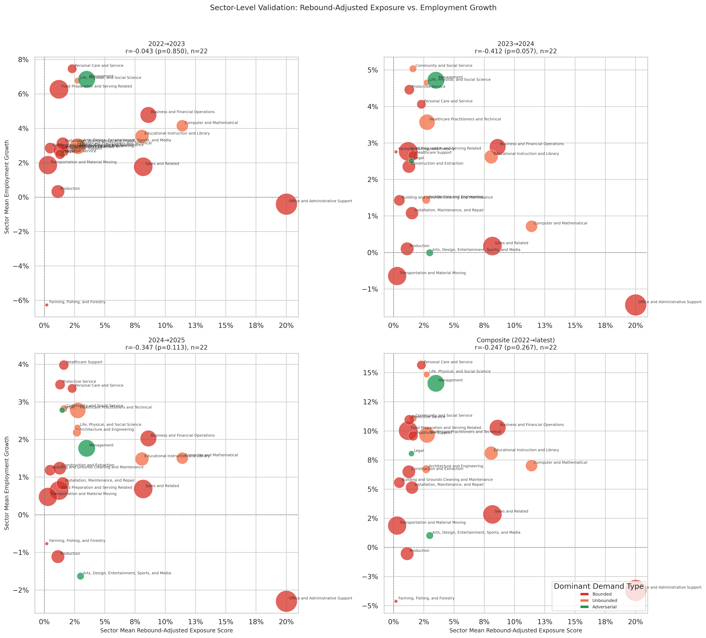

# Sector-Level Employment Validation (Per Year)

**File:** `sector_level_employment_validation.png`

## What this chart shows

Each bubble is one BLS major occupational group. The x-axis is the sector's employment-weighted mean rebound-adjusted exposure score; the y-axis is that sector's mean employment growth for the given period. Bubble size scales with total sector employment. The four panels show each BLS year-over-year period plus the composite.

This is the per-period expansion of the composite panel in `sector_level_validation.png`.

## Correlation by period

| Period | r | p |
|--------|---|---|
| 2022→2023 | +0.043 | 0.850 |
| 2023→2024 | −0.412 | 0.057 |
| 2024→2025 | −0.347 | 0.313 |
| Composite | −0.247 | 0.267 |

## Key observations

**2022→2023: no signal.** The first panel is nearly flat — sectors with high rebound-adjusted exposure grew at the same rate as sectors with low exposure. AI adoption was not yet differentiated enough at the sector level to affect employment outcomes.

**2023→2024: the strongest and most suggestive signal (r = −0.412, p = 0.057).** This period approaches conventional significance. The negative sign is in the expected direction — higher displacement exposure associates with weaker employment growth — but the relationship is driven heavily by Office and Administrative Support, the largest bubble, which had both the highest Bounded exposure score and one of the weaker employment growth outcomes in this period. Excluding that sector would substantially change the r.

**2024→2025: weaker negative signal (r = −0.347, p = 0.313).** The direction is consistent with 2023→24 but the p-value is well above significance thresholds. The relationship is visible but not statistically robust, and the scatter is wide.

**Composite: r = −0.247, p = 0.267.** The composite averages across all periods and loses the concentrated 2023→24 signal. No period produces a statistically significant result under conventional α = 0.05.

## The Office and Administrative Support outlier

The large red bubble (Office and Administrative Support) consistently sits in the right portion of the x-axis (high Bounded exposure) while its y-axis position varies by period. It is the single most influential data point in all four panels. In 2023→24, it appears near the bottom of the y-axis range, contributing strongly to the negative r. In 2024→25, it recovers modestly. Any interpretation of the rebound model's sector-level employment signal should be tested with this sector excluded.

## Comparison to the dynamic model

The rebound model's sector employment correlations are small, inconsistent across periods, and all non-significant. The comparable dynamic model chart (`dynamic_sector_level_employment_validation.png`) shows r > +0.5 in three of four periods, all statistically significant. The two models are pointing in opposite directions at the sector level — the rebound model says high-exposure sectors grew slightly less; the dynamic model says Unbounded-dominant sectors grew more. Both narratives are consistent with the BLS data, because they emphasize different contrasts: the rebound model contrasts Bounded-heavy sectors against others; the dynamic model contrasts Unbounded-heavy sectors against others.
