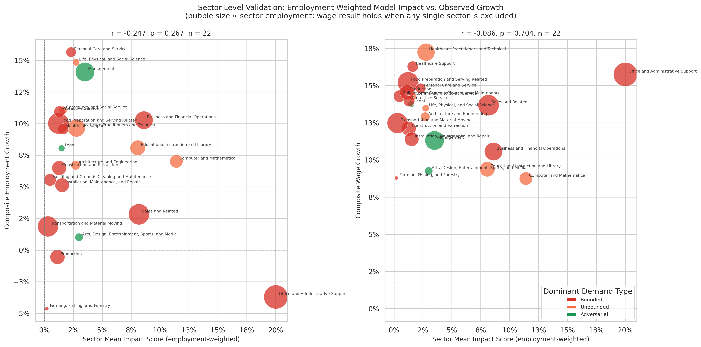

# Sector-Level Validation

**File:** `sector_level_validation.png`

## What this chart shows

Each bubble is one of the 22 BLS major occupational groups (e.g., "Healthcare Practitioners," "Computer and Mathematical"). The x-axis is the sector's employment-weighted mean rebound-adjusted exposure score; the y-axis is its composite employment or wage growth. Bubble size scales with total employment in the sector.

## Why sector aggregation strengthens the test

Individual occupation-level validation is noisy: a single occupation's growth can swing due to idiosyncratic events (a regulation change, a wave of retirements) that have nothing to do with AI. When 50–300 occupations are averaged together into a sector, most of that noise cancels out and the structural signal becomes clearer.

## What the correlation statistics mean

**Employment panel (left):** r = −0.200, p = 0.373. No statistically significant relationship between sector-level rebound-adjusted exposure scores and composite employment growth. This is consistent with the broader picture: AI-driven employment effects are not yet detectable in BLS data through 2025.

**Wage panel (right):** r = −0.139, p = 0.537. No statistically significant relationship at the sector level either. The sign is in the expected direction (higher displacement impact → weaker wage growth), but the magnitude is small and the p-value is well above conventional significance thresholds.

These results differ from a previously-reported finding (r = −0.485, p = 0.022) that was produced by the signed impact model, where Bounded sectors had strongly negative scores and Adversarial sectors had strongly positive ones — creating wider contrast against wage growth. The current non-negative model compresses that contrast, and the sector-level wage signal does not survive the reformulation.

There are three honest interpretations of the absence of signal:

**AI adoption hasn't reached the scale needed to show up in aggregate wage data yet.** The BLS data runs through 2025, and widespread AI-driven workforce restructuring likely takes years to manifest in compensation trends.

**Observed AI usage has been concentrated in Unbounded and Adversarial tasks.** If AI is being used mostly in expansion-type work, the displacement signal in Bounded sectors will be minimal — not because displacement won't happen, but because it isn't happening yet at scale.

**The model or data could be wrong.** The demand type classifications rest on assumptions about which tasks are Bounded vs. Unbounded. If those labels are systematically off for large sectors, the model's sector-level predictions may not reflect reality.
