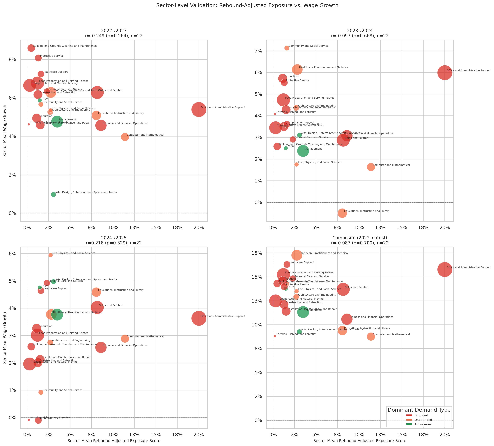

# Sector-Level Validation

**File:** `sector_level_validation.png`

## What this chart shows

Each bubble is one of the 22 BLS major occupational groups (e.g., "Healthcare Practitioners," "Computer and Mathematical"). The x-axis is the sector's employment-weighted mean rebound-adjusted exposure score; the y-axis is its composite employment or wage growth. Bubble size scales with total employment in the sector.

## Why sector aggregation strengthens the test

Individual occupation-level validation is noisy: a single occupation's growth can swing due to idiosyncratic events (a regulation change, a wave of retirements) that have nothing to do with AI. When 50–300 occupations are averaged together into a sector, most of that noise cancels out and the structural signal becomes clearer.

## Composite correlation statistics

**Employment panel (left):** r = −0.247, p = 0.267. No statistically significant relationship between sector-level rebound-adjusted exposure scores and composite employment growth.

**Wage panel (right):** r = −0.086, p = 0.704. No statistically significant relationship at the sector level. The sign is in the expected direction (higher displacement impact → weaker wage growth), but the magnitude is small and the p-value is well above conventional significance thresholds.

## Per-year breakdown

The composite view masks variation across years. See `sector_level_employment_validation.png` and `sector_level_wage_validation.png` for the full per-period grids.

### Employment correlations by period

| Period | r | p |
|--------|---|---|
| 2022→2023 | +0.043 | 0.850 |
| 2023→2024 | −0.412 | 0.057 |
| 2024→2025 | −0.347 | 0.313 |
| Composite | −0.247 | 0.267 |

The 2023→24 period is the most informative single-period view: r = −0.412 approaches conventional significance (p = 0.057), with Office and Administrative Support as the key driver — the largest Bounded-exposure sector with below-average employment growth that year. No individual period reaches p < 0.05.

### Wage correlations by period

| Period | r | p |
|--------|---|---|
| 2022→2023 | +0.249 | 0.264 |
| 2023→2024 | +0.097 | 0.668 |
| 2024→2025 | +0.218 | 0.329 |
| Composite | +0.087 | 0.700 |

Wage correlations are consistently positive but never significant. See `sector_level_wage_validation.md` for interpretation.

## Comparison to the dynamic model

The dynamic equilibrium model produces substantially stronger sector-level employment correlations across all periods. See `dynamic_sector_level_validation.md` for the full comparison.

| Period | Rebound emp r | Dynamic emp r |
|--------|--------------|---------------|
| 2022→2023 | +0.043 | +0.329 |
| 2023→2024 | −0.412 | +0.544 ** |
| 2024→2025 | −0.347 | +0.532 ** |
| Composite | −0.247 | +0.528 * |

(* p < 0.05, ** p < 0.01)

The sign reversal between models reflects what each model emphasizes: the rebound model scores Bounded sectors highest (displacement pressure), while the dynamic model scores Unbounded sectors highest (absorption gain). Unbounded sectors outgrew Bounded sectors in BLS data, so the dynamic model's positive predictions align better with observed outcomes.

## Interpreting the absence of signal in the rebound model

There are three honest interpretations:

**AI adoption hasn't reached the scale needed to show up in aggregate employment data yet.** The BLS data runs through 2025, and widespread AI-driven workforce restructuring likely takes years to manifest in headcount changes.

**Observed AI usage has been concentrated in Unbounded and Adversarial tasks.** If AI is being used mostly in expansion-type work, the displacement signal in Bounded sectors will be minimal — not because displacement won't happen, but because it isn't happening yet at scale.

**The model or data could be wrong.** The demand type classifications rest on assumptions about which tasks are Bounded vs. Unbounded. If those labels are systematically off for large sectors, the model's predictions may not reflect reality.
