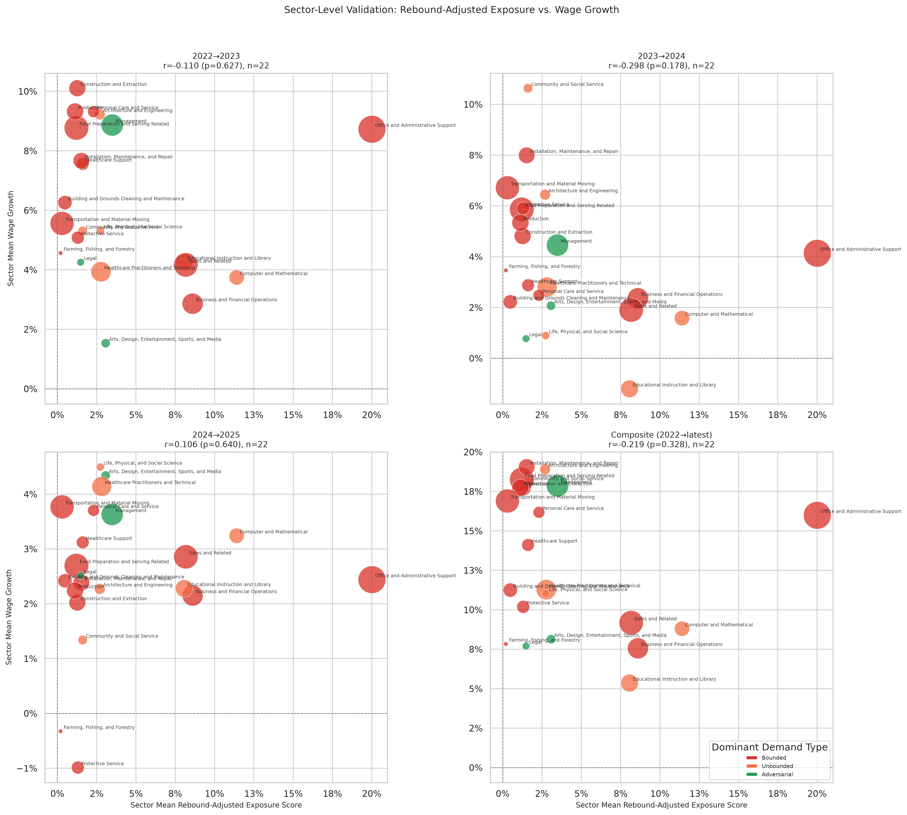

# Sector-Level Wage Validation (Per Year)

**File:** `sector_level_wage_validation.png`

## What this chart shows

Same layout as `sector_level_employment_validation.png` but with the growth of each major group's median wage (from `bls_sector_trends.csv`) on the y-axis. Four panels: 2022→23, 2023→24, 2024→25, composite.

## Correlation by period

| Period | r | p |
|--------|---|---|
| 2022→2023 | −0.108 | 0.631 |
| 2023→2024 | −0.297 | 0.179 |
| 2024→2025 | +0.104 | 0.645 |
| Composite | −0.218 | 0.330 |

## Key observations

**Weakly negative, never significant.** Measured against each major group's own median wage, higher rebound-adjusted exposure is weakly associated with lower wage growth — the expected direction for a displacement measure — but no period comes near significance. (An earlier version of this chart, built on the mean wage growth of surviving detailed occupations, showed the opposite sign; that was a survivorship artefact, not a finding.)

**The rebound model is not built to predict wage direction.** It measures structural exposure pressure, which could manifest as wage suppression (if supply exceeds demand) or wage growth (if remaining workers capture productivity gains). A null here is the expected result.

## Comparison to the dynamic model and to raw coverage

The dynamic model's sector wage correlations (`dynamic_sector_level_wage_validation.png`) are also non-significant. Neither demand-type model has a detectable sector-level wage signal. Raw observed AI coverage does — composite r = −0.502 (p = 0.017), see `anthropic_observed_sector_level_wage_validation.md` — so the demand-type discount is throwing away wage information that the underlying coverage measure carries.
